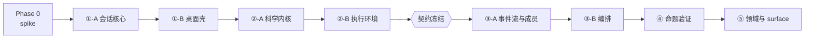

# 主开发规划（Master Roadmap）

- **日期**：2026-08-07
- **上游规格**：`docs/superpowers/specs/2026-08-06-multi-agent-ds-workbench-design.md`
- **状态**：规划基线，随决策门更新
- **性质**：本文档管**全局**——交付物、依赖、决策门、风险、变更控制。**步骤级细节不在这里**，见各阶段独立计划。

---

## 1. 规划原则

这五条决定了本规划长成这个样子。

### 1.1 详细计划即时编写

**不提前为 10 个月后的工作写步骤级计划。** 理由：那种细节的半衰期是几周——依赖会变、spike 会推翻假设、上一阶段的实际形态会改变下一阶段的入口。

每份详细计划在**其前置阶段验收通过后**才写。本文档负责的是让每份计划知道自己的边界。

### 1.2 每个阶段独立可停

任何阶段结束时项目都处在一个**可用、可交付、可以就此打住**的状态。没有"做到一半没法用"的阶段。

这是对抗动力衰减的主要手段：即使中途停下，已投入的时间也换到了东西。

### 1.3 决策门优先于时间表

时间估算（周数）是**参考量**，决策门是**硬约束**。门没过就不往下走，哪怕时间充裕；门过了就继续，哪怕超期。

### 1.4 不变式是宪法

spec 第 5 节的五条不变式高于任何阶段目标。**任何阶段的实现若与不变式冲突，改实现，不改不变式**——除非有充分理由修订不变式，且修订必须记入开发历史（如 2026-08-07 对不变式 1 的重写）。

### 1.5 范围默认关闭

新想法默认进 backlog，不进当前阶段。准入规则见第 8 节。

### 1.6 已定案的基础决策（不再重开）

| 决策 | 结论 | 日期 |
|---|---|---|
| 主体语言 | **TypeScript / Node** | 2026-08-07 |
| 桌面壳 | **Electron**（后期可换 Bun 编译薄壳，业务代码同一份） | 2026-08-07 |
| 形态 | **桌面应用，不做 Web 版** | 2026-08-07 |
| 界面模型 | **对话 / 笔记本 / 并排三视图，同一 Entry 序列的三种投影** | 2026-08-07 |
| 编排定位 | **可插拔模块**，经 MCP 与子进程边界解耦 | 2026-08-07 |
| 默认 agent | **DeepSeek + Native loop**，可切 claude / codex / kimi / qwen | 2026-08-07 |

重开任一条需走 §8.3 的修订流程。

---

## 2. 交付物地图

**每一行都是一个可以就此停下的状态。**

| 阶段 | 停在这里，你得到什么 | 对谁有用 |
|---|---|---|
| Phase 0 | 三份技术事实报告（`FINDINGS.md`） | 决定后续全部技术选型 |
| ① -A | **CLI 版多会话 agent 宿主**：能同时跑 DeepSeek / claude / codex，CLI 的能真接管 | 自己命令行用 |
| ① -B | **桌面应用**：Project 管理 · 对话/笔记本/并排三视图 · 模型切换 · Skills 市场 | 日常替代 Claude app + 多开终端 |
| ② -A | **+ 持久 Python / R 会话**，可中断，图表可渲染 | 日常数据分析 |
| ② -B | **+ 远程与 GPU 执行环境、长任务管理** | 真实科研工作流 |
| ③ | **+ 多智能体编排**：leader 拆任务、协作与验证分离 | 核心命题的载体 |
| ④ | **命题的量化答案** | 决定这条路对不对 |
| ⑤ | **+ ML/DL 领域内容、对外 surface** | 完整产品 |

**关键观察**：① + ② 结束时，你已经拥有一个可日常使用的数据科学工作台，**且它完全不依赖多智能体命题是否成立**。③④ 是在一个已经站得住的产品上做实验，不是把全部赌注押在假设上。

---

## 3. 计划分解

八份文档，各自独立可执行。

| # | 计划文档 | 范围 | 何时编写 | 前置 |
|---|---|---|---|---|
| 1 | `2026-08-06-phase0-and-session-core.md` ✅ **已完成** | Phase 0 四个 spike + 阶段①-A 会话核心 | 已写 | — |
| 2 | `stage1b-desktop-shell.md` | Electron 外壳 · **Project 管理（打开文件夹为项目）** · **Entry 序列与三视图（对话/笔记本/并排）** · **cell 编辑器** · **模型切换器** · **Skills 市场与用户自建 Skill** · 终端组件 | ①-A 验收后 | 计划 1 |
| 3 | `stage2a-jupyter-kernels.md` | Jupyter 协议客户端、Ark(R)、ipykernel、中断、富输出、REPL UI | ①-B 验收后 | 计划 2 |
| 4 | `stage2b-exec-environments.md` | 本地/WSL/SSH/GPU 环境探测、Run 管理、凭证、Skills、产物存储 | ②-A 验收后 | 计划 3 |
| 5 | `stage3a-event-log-and-members.md` | 统一事件流、成员注册表、`mode` 派生、协作空间、可见范围过滤 | ②-B 验收后 | 计划 4 + **契约冻结**（§4.2） |
| 6 | `stage3b-orchestration.md` | 派单/回报契约、Hook 完成信号、交叉核对、worktree、capability 授权、协作拓扑 | 计划 5 验收后 | 计划 5 |
| 7 | `stage4-hypothesis-validation.md` | 任务图可视化、度量框架、附和检测、运行报告 | ③ 验收后 | 计划 6 |
| 8 | `stage5-domain-and-surfaces.md` | ML/DL Skills、数据科学 MCP、ACP/A2A surface、跨平台打包 | ④ 验收后 | 计划 7 |

**阶段 ③ 拆成两份**（5 和 6）的理由：事件流与成员模型是编排的地基，且它决定数据 schema。先把地基单独立稳、单独验收，再做其上的编排逻辑——避免 schema 在编排逻辑写到一半时被迫返工。

---

### 3.1 实体清单

每份详细计划要造的**具体部件**，连同其技术栈与构思来源，集中登记在：

```
docs/superpowers/ENTITY-REGISTRY.md    68 个实体，按阶段分组
```

**写详细计划前必须先查它**——它约束了每个部件用什么技术、照着谁的设计做，避免临场发明。实体编号（#1–#68）是跨文档的稳定引用。

---

## 4. 依赖与冻结点

### 4.1 阶段依赖图



严格串行。**不做并行**——单人项目并行只会同时开两个半成品。

### 4.2 契约冻结点（跨阶段最大的返工风险）

阶段 ③ 需要把 ② 产出的东西当作 **Repo 事实层证据**（不变式 5）。若 ② 的数据模型不满足 ③ 的查询需求，③ 开工时会被迫回头改 ②，代价极高。

**因此在 ②-B 验收时设一个冻结检查**，逐项确认：

| ③ 需要的 | ② 必须已提供 | 验证方式 |
|---|---|---|
| 某次运行的确定性标识 | Run 有稳定 ID 与不可变快照 | 重启后按 ID 可完整取回 |
| 测试通过与否 | Run 记录退出码，非仅日志文本 | 结构化字段，不需解析文本 |
| 命令实际执行记录 | Run 记录实际命令与参数 | 可与 agent 的 `commands_run` 声明比对 |
| 文件变更事实 | 产物存储可回答"这次运行改了哪些文件" | 与 `git diff` 交叉核对 |
| 环境一致性 | Run 绑定环境快照 | 可回答"这个结果是在哪个环境跑出来的" |
| 时间顺序 | 所有记录带单调时间戳 | 可重建事件序列 |

**任何一项缺失，②-B 不得验收。** 这六行是 ③ 的入口条件，宁可在 ② 多花两周，也不要在 ③ 返工两个月。

### 4.3 反向约束：② 不得引入 ③ 的概念

对称的纪律：**阶段 ② 不得为了"③ 以后要用"而提前引入成员、角色、编排概念**。② 只需产出**事实**，不需知道谁会消费这些事实。

违反这条会让 ② 背上没人用的抽象，且在 ③ 真正落地时发现抽象定错了。

---

## 5. 决策门

七个必须停下来判断的点。每个门有明确的通过判据与不通过的应对。

| 门 | 位置 | 问题 | 不通过怎么办 |
|---|---|---|---|
| **G0** | Phase 0 结束 | pi 可嵌入？PTY+MCP+Hook 三件套可通？Electron 多终端可用？**nteract 栈能起内核并中断？** | 见计划 1 各 spike 的应对分支；**Spike D 不过则回退 Python 方案** |
| **G1** | ①-A 结束 | 四个会话能并存？CLI 的能真接管？全局配置未被污染？ | 隔离失败 → 改用独立 HOME 或容器 |
| **G2** | ①-B 结束 | 桌面壳日常可用？**你是否真的开始用它替代裸终端？** | 否 → 停下来查为什么，不要带着一个自己都不用的工具往下做 |
| **G3** | ②-A 结束 | R 与 Python 会话可持久、**可中断**、可渲染图表？ | 中断做不通 → 记为已知限制并明确告知用户，不静默降级 |
| **G4** | ②-B 结束 | **§4.2 的六项契约冻结检查全过？** | 任一项不过 → 补齐后再验收，不得进 ③ |
| **G5** | ③-B 结束 | 编排能跑通全流程？**人为让 worker 谎报改动，系统能标出 `untrusted`？** | 交叉核对失效 → 整个防幻觉机制不成立，必须修好 |
| **G6** | ④ 结束 | 命题成立吗？多 agent 的缺陷检出率是否显著高于单 agent 基线？ | **不成立 → 见 §9.2** |

**G2 是最容易被忽略、也最重要的门。** 一个连作者自己都不愿日常使用的工具，后面九个月的投入都建在沙上。这个门的判据不是功能清单，是**行为**：连续两周你是否主动打开它。

---

## 6. 里程碑与节奏

### 6.1 时间估算

| 阶段 | 估算 | 累计 |
|---|---|---|
| Phase 0 | 1.5–2.5 周（含 Spike D） | 2.5 周 |
| ①-A | 4–5 周 | 7 周 |
| ①-B | 3–4 周 | 11 周 |
| ②-A | 8–10 周 | 21 周 |
| ②-B | 8–10 周 | 31 周 |
| ③-A | 3–4 周 | 35 周 |
| ③-B | 6–8 周 | 43 周 |
| ④ | 4–6 周 | 49 周 |
| ⑤ | 6–8 周 | 57 周 |

**约 13 个月。** 这是单人 + AI 协同、非全职投入的估算。

### 6.2 估算的可信度

| 阶段 | 可信度 | 原因 |
|---|---|---|
| Phase 0、①-A | 高 | 范围已细化到步骤级 |
| ①-B、②-A | 中 | 有明确参考实现（Rho、Buzz） |
| ②-B | **低** | 环境探测的平台差异是经典的估算黑洞 |
| ③、④ | 中 | 设计充分，但交叉核对的实际可靠性未验证 |
| ⑤ | 低 | 范围本身弹性大 |

**②-B 是最可能超期的阶段。** 若超出 14 周，启用裁剪预案：只做本地 + SSH，GPU 环境后置到 ⑤。

### 6.3 每阶段的固定收尾动作

每个阶段验收时**必做**，不可跳过：

1. 全量测试通过 + 类型检查零错误
2. 走一遍该阶段的决策门判据
3. **不变式合规复查**（§7）
4. 更新 `docs/DEVELOPMENT_HISTORY.md`
5. 编写下一阶段的详细计划
6. 复查本文档：估算是否需要修正、风险是否有变化、backlog 是否有项目该提上来

---

## 7. 不变式合规检查点

五条不变式不是写完就算数的。**每个阶段验收时逐条复查**，用具体问题而非泛泛确认。

| 不变式 | 复查问题 | 从哪个阶段开始适用 |
|---|---|---|
| 1 · 验证隔离 | 投喂给验证角色的上下文里，是否**混进了**协作空间的讨论？有没有绕过 `visibleTo()` 的路径？ | ③-A |
| 2 · 模式决定生命周期 | 是否存在绕过 `mode` 单独设置 `lifecycle` 或可见范围的口子？ | ③-A |
| 3 · 没有不可见的行动 | 是否存在不进事件流的状态变更？特别是错误路径与恢复路径 | ①-A（会话状态）起 |
| 4 · 记忆是投影 | 长驻 agent 的上下文是否在悄悄累积？`Exhausted` 分支是否真的会触发，还是永远走不到 | ③-A |
| 5 · 声明层 / 事实层分离 | 是否存在只凭 agent 声明就推进状态的路径？ | ②-B（事实层建成）起 |

**这张表本身也是回归测试的清单来源**——每条复查问题都应有对应的自动化测试。

---

## 8. 变更控制

**这是本规划最重要的一节。**

### 8.1 为什么需要

本项目的设计过程中，参考项目从 2 个增加到 8 个，每个都带来了新想法。这些想法多数是好的——但**好想法的数量是无限的，时间不是**。

已发生的三次实质变更：阶段顺序重排、不变式 1 重写、构建策略从 fork 改为独立实现。**每一次都是正确的**，但它们发生在设计期。进入实现期后，同样频率的变更会让项目永远做不完。

### 8.2 准入规则

任何新想法（来自新发现的仓库、新论文、新工具、临时灵感）按此处理：

```
新想法进来
   │
   ├─ 它是否修复一个已确认的缺陷？
   │     是 → 允许进入当前阶段，走正常修复流程
   │
   ├─ 它是否与某条不变式冲突？
   │     是 → 必须先走不变式修订流程（§8.3），不得直接实现
   │
   ├─ 它是否属于当前阶段的既定范围？
   │     是 → 允许
   │
   └─ 其余全部 → BACKLOG，本阶段不动
```

**唯一例外**：发现的问题若会导致后续阶段大规模返工（如 §4.2 的契约缺口），立即处理。

### 8.3 不变式修订流程

不变式可以改，但要有仪式感——它们是宪法：

1. 写清**当前不变式挡住了什么**（具体场景，非抽象论述）
2. 写清**修订后失去什么保护**（对照 spec 第 2 节的四种失效模式）
3. 检查**下游影响**：全文搜索该不变式的引用，逐一评估
4. 记入 `DEVELOPMENT_HISTORY.md`，说明修订理由

2026-08-07 对不变式 1 的重写即为范例。

### 8.4 Backlog

新想法记入 `docs/superpowers/BACKLOG.md`，每条含：来源、一句话描述、**它服务于第 2 节命题的哪一部分**（答不上来的直接丢弃）、预估归属阶段。

每个阶段收尾时复查一次 backlog，决定是否有项目该提上来。

### 8.5 参考项目冻结

**当前八个参考项目（AgentDeck、pi、Buzz、Rho、wispterm、wisp-science、ccb、hive）已足够。**

进入实现期后，除非遇到具体的、当前参考无法解答的技术问题，否则**不再引入新的参考项目**。遇到时也只针对该问题定向查阅，不做全仓库通读。

理由：参考资料的边际收益已经为负——现在缺的不是灵感，是把 Phase 0 跑通。

---

## 9. 风险登记册

### 9.1 风险表

| # | 风险 | 触发信号 | 应对 | 归属 |
|---|---|---|---|---|
| R1 | **动力衰减** | 连续两周未推进 | 回到 §2 交付物地图，确认当前已得到什么；考虑停在某个可停点 | 全程 |
| R2 | **范围蔓延** | 当前阶段实际内容超出计划 30% | 执行 §8.2 准入规则，超出部分退回 backlog | 全程 |
| R3 | **②-B 估算失准** | 超出 14 周 | 裁剪：只做本地 + SSH，GPU 后置到 ⑤ | ②-B |
| R4 | **Provider 适配腐烂** | 某个 CLI 升级后 smoke test 失败 | 每 provider 一个 smoke test；失败响亮报错，禁止静默降级 | ①-A 起 |
| R5 | **Jupyter 中断做不通** | ②-A spike 失败 | 记为已知限制，明确告知用户；不静默降级成"能跑但停不下来" | ②-A |
| R6 | **交叉核对不可靠** | G5 的谎报测试失败 | 这是核心机制，必须修好；修不好则整个防幻觉主张不成立 | ③-B |
| R7 | **核心命题被证伪** | G6 量化结果为负或不显著 | 见 §9.2 | ④ |
| R8 | **孤儿进程 / GPU 占用** | 停止会话后 `nvidia-smi` 仍有残留 | 进程组终止（spec 7.18）；把它做成回归测试 | ①-A 起 |
| R9 | **上下文成本失控** | 单次运行 token 消耗超预期数倍 | 记忆投影（不变式 4）+ 预算上限 + `Exhausted` 分支 | ③-A |
| R10 | **pi 上游破坏性变更** | 升级后编译失败 | 锁定版本；Session Host 内做薄封装，不让 pi 类型泄漏到上层 | ①-A 起 |

### 9.2 R7 专项：命题被证伪怎么办

这是唯一一个**不能靠工程手段解决**的风险，必须预先想清楚。

若阶段 ④ 的量化结果显示多 agent 交叉验证**没有**显著降低缺陷：

1. **①②仍然成立** —— 数据科学工作台的价值不依赖这个命题。不要因为实验为负就否定已建成的东西。
2. **先查是不是实现问题**：验证隔离是否真的生效？验收标准是否写得太松？样本量是否够？
3. **若确实是命题问题**，把 ③ 的定位从"降幻觉机制"改为"并行加速与分工机制"——它仍然有用，只是价值主张不同。
4. **把负结果写下来公开。** 这个领域缺的正是诚实的负结果。

**预先接受这个可能性，比事后自我说服有价值得多。**

---

## 10. 回归防护

随阶段推进，前面建成的东西必须保持可用。

| 层级 | 内容 | 何时跑 |
|---|---|---|
| **单元测试** | 纯逻辑：配置校验、租约、事件过滤、状态机 | 每次提交 |
| **集成测试** | 跨真实边界：PTY、SQLite、kernel 协议、git | 每次提交 |
| **Provider smoke test** | 每个 CLI 一个：起进程 → 发一句 → 确认响应 + 工具可见 | 手动，每阶段验收 + provider 升级后 |
| **不变式回归** | §7 每条复查问题对应的自动化测试 | 每次提交（从其适用阶段起） |
| **端到端** | 阶段 ③ 起：完整编排流程 + **谎报检测** | 每阶段验收 |

**特别标注**：`untrusted` 检测（worker 谎报改动时系统能否发现）是**最重要的单条测试**。它验证的是整个项目防幻觉主张的落地。这条测试挂了，其他全绿也没有意义。

---

## 11. 当前状态与下一步

| 项 | 状态 |
|---|---|
| 设计规格 | ✅ 完成（1,093 行，五条不变式，八个参考项目定位明确） |
| 主规划 | ✅ 本文档 |
| Phase 0 + ①-A 详细计划 | ✅ 完成（2,556 行，16 任务 92 步骤） |
| **Phase 0（四个 spike）** | ✅ **完成，2026-08-08。四项全过，G0 通过** |
| 阶段 ①-A 代码 | ⬜ 未开始（下一步：Task 1.1） |

**G0 判定（2026-08-08）**：四个 spike 全部通过，结论见 `spikes/FINDINGS.md` 顶部汇总表。

- **A** pi 可嵌入且 schema 由引擎强制并自动重试 → Native Runtime 用 pi，**不自建 loop**
- **B** PTY + MCP 注入 + Stop hook 全通（claude）→ 回合结束信号可靠，**不必只靠超时**
- **C** 四终端并发刷屏无冻结 → 桌面壳定 Electron，**当前规模无需背压**
- **D** 内核可起、可取输出、**可中断**，Electron 下 zeromq 免 rebuild → **规格 10.1 的 TypeScript 定案成立，不回退 Python**

**下一步**：执行 Part 1 的 Task 1.1（Provider 注册表 schema），进入阶段 ①-A。

**Phase 0 期间修改的既有决策**（详见 FINDINGS 的「由 spike 确定或修改的技术决策」表）：工具 schema 改用 TypeBox（zod 仅管配置）；DeepSeek 的 model id 必须钉 v4 版本；隔离改用 claude 的显式标志而非 `CLAUDE_CONFIG_DIR`；②-A 新增约束——用薄适配器隔离 rxjs。

**仍需你本人在自己机器上完成的部分**：codex 的 MCP + `notify` 回路未跑通（`codex exec` 超时）；R 内核需先修复 `ir` kernelspec 或改用 Ark（归属 ②-A）。

---

## 附录：文档地图

```
docs/
├── DEVELOPMENT_HISTORY.md                    每次变更的记录（最新在上）
└── superpowers/
    ├── specs/
    │   └── 2026-08-06-multi-agent-ds-workbench-design.md    设计规格（宪法）
    ├── plans/
    │   ├── 2026-08-07-master-roadmap.md                     本文档（全局规划）
    │   ├── 2026-08-06-phase0-and-session-core.md            ✅ 已写
    │   └── （其余七份，即时编写）
    ├── ENTITY-REGISTRY.md                                   68 个实体 × 技术栈 × 来源
    └── BACKLOG.md                                           新想法暂存，见 §8.4
```

**四份文档的分工**：

| 文档 | 回答 |
|---|---|
| 规格 | 建什么、为什么、什么绝不做 |
| 主规划 | 按什么顺序、在哪停下判断、风险怎么应对 |
| **实体清单** | **每个部件用什么技术、照着谁的设计做** |
| 详细计划 | 这一步具体敲什么 |
