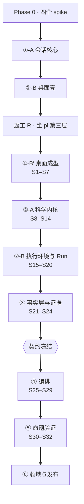

# DAWN Science 主开发规划 v2

- **日期**：2026-08-08
- **取代**：`2026-08-07-master-roadmap.md`（已降为存根）
- **依据**：本次重写前完整阅读了 **Hermes**（`apps/desktop`，MIT）、**Rho**（Rust + Tauri，MIT）、**wisp-science**（Rust + Tauri，AGPL）、**pi**（MIT，同时是运行依赖）四个项目的源码与设计文档
- **写法**：每个开发步骤给出 **技术栈 / 成果 / 效果 / 技术栈来源 / 对标** 五项

---

## 0. 为什么重写

旧规划不是写错了，是**写浅了**。它回答了「先做哪个阶段」，没回答「每一步交出什么、凭什么这么做、做到什么程度算数」。

重写的直接触发是一次参考地图的澄清。澄清过程中修正了两个我自己的错误判断，两个都会影响排期：

| 我原先说的 | 实际读到的 |
|---|---|
| 「Rho 是科学场景的呈现层参考」 | **Rho 与 DAWN 是同物种**。`rho-store` 10,835 行里，audit + evidence + compare 占 4,680 行（**43%**）——事实层不是附加功能，是科学工作台最重的那块 |
| 「多 agent 编排与防幻觉没有外部老师」 | **wisp-science 有完整实现**：有界 DAG 派单、能力解析、Roundtable 交叉评审、worktree 隔离与 cherry-pick、嵌套深度上限。同域、AGPL、可读 |

第二条尤其重要：它把「唯一无参照区域」这个风险从**整个阶段 ④** 缩小到 **只剩不变式 4（记忆投影）与阶段 ⑤（量化验证）**。

---

## 1. 终极目标与它的保护机制

### 1.1 目标（不得被步骤稀释）

> **`问题 → 规划 → 调用工具 → 执行流程 → 产生可追溯结果`**
>
> 一个面向数据密集型自然科学（数据科学 · 生态学 · 环境科学 · 生物信息）的多智能体协同工作台，桌面形态。

三个层面，**按建造顺序**：

1. **单 agent 工作台** —— 不开编排时，它是一个能驱动 Claude Code / Codex / 任意 API 模型的工作台
2. **数据科学工作台** —— 持久 Python/R 会话、本地与远程执行环境、长任务、Skills 与 MCP
3. **长驻团队协同** —— 实验性命题，见 §1.3

### 1.2 保护机制一：每个阶段都是可停点

**①+② 合起来即是一个可日常使用的数据科学工作台。③④⑤ 全部砍掉，产品依然成立。**

这不是安慰话，是排期约束：**任何一步都不得让「拿掉编排就不能用」成为事实**。编排通过 MCP 与子进程边界解耦，主体不知道它存在。

每个阶段结束时必须能回答：**现在停下，用户手里有什么？**

| 停在 | 用户拿到 |
|---|---|
| ①-B′ | 一个能对话、能跑外部 CLI、能看见改了哪些文件的桌面 agent 客户端 |
| ②-A | 加上持久 Python/R 会话与富输出 —— 已可替代 Jupyter 日常用途 |
| ②-B | 加上远程/GPU 执行与 Run 记录 —— 已可替代一部分 RStudio/VSCode 工作流 |
| ③ | 加上可复现性审计与运行对比 —— **这一步之后它是「科研工具」而不是「AI 编辑器」** |
| ④ | 加上多 agent 协同 |
| ⑤ | 加上「这套东西到底有没有用」的量化答案 |

### 1.3 保护机制二：核心命题必须可证伪

**命题**：多个 agent 交叉验证，能显著降低 AI 幻觉造成的错误交付。

**这是假设，不是事实。** 五条不变式的全部存在理由，是让阶段 ⑤ 的度量成为可能。任何一条被为了赶工绕过，⑤ 就失去意义，③④ 就退化成「更花哨的 AI 编辑器」。

### 1.4 保护机制三：诚实的命名纪律

从 Rho 与 wisp-science 各学到一条，合并为本项目纪律：

> **Rho**：审计结果的最好状态叫 `complete`，**刻意不叫 `reproducible` 也不叫 `passed`**。
> **wisp-science**：在干净重跑满足完整契约之前，产物叫 **Publication Evidence / Traceability Capsule**，**不声称 full reproducibility**。

**DAWN 采纳**：任何面向用户的状态词，只能声称我们真正验证过的东西。`provenance_complete` 说的是「链路齐全」，不是「结果正确」。这条纪律写进协议的字段命名，不只是写进文档。

### 1.5 保护机制四：五条不变式的落点必须在步骤里指名

§5 每个步骤如果与不变式相关，必须写明**挂在哪条上**。没有落点的不变式是装饰。

---

## 2. 参考地图：谁教什么，什么关系

**两种关系，不可混淆**：

> **Hermes / wisp-science / Rho：读设计，不复用代码。**
> **pi：直接坐在上面。我们不学它，我们用它。**

把 pi 说成「教会我们 agent 怎么写」，隐含的下一步是「学会了 → 自己写一个」——那正是本项目已经推翻过一次的路线。

| 学什么 | 谁 | 许可 | 关系 | 凭什么可学 |
|---|---|---|---|---|
| 桌面应用怎么写 | **Hermes** `apps/desktop` | MIT | 读设计 | 同栈（Electron+React+Vite）；`DESIGN.md` 337 行 + `AGENTS.md` 210 行**写明取舍理由**；19 个 e2e spec |
| 科学工作台 × agent 怎么合成 | **Rho** | MIT | 读设计 | 同物种；`rho-protocol/workbench.rs` 493 行公开协议；audit/evidence/compare 三份设计文档共 2,213 行 |
| 科学证据与发表级溯源 | **wisp-science** | AGPL | 读设计 | 同域；`publication-evidence.md` 的四级能力阶梯 |
| 多 agent 编排与防幻觉 | **wisp-science** `agent-delegation.md` | AGPL | 读设计 | 562 行，有界 DAG、能力解析、Roundtable、worktree 隔离 |
| 记忆投影（不变式 4） | AgentDeck（自有）+ Buzz | 自有 / Apache-2.0 | 设计萃取 | **唯一缺成熟外部对照的一格** |
| AI agent 怎么跑 | **pi** | MIT | **运行依赖** | `pi-agent-core` = `packages/agent`，harness 提供 compaction/session/skills/system-prompt/tools |

**pi 的分层已定案**（见 `specs/2026-08-08-dependency-layering-decision.md`）：
`src/runtime/native.ts` 从 `@earendil-works/pi-coding-agent` 取 `createAgentSession`，其下自动获得 `pi-agent-core` 的 harness 与 `pi-ai` 的 39 个 provider。

---

## 3. 从四个项目读到的、直接改写本规划的十条

这一节是本次重写的实质内容。每条都注明出处，且都在 §5 有对应步骤。

### 3.1 缺失不等于相同（Rho）

> *"If either side lacks a source revision, environment snapshot, artifact link, or other field, the comparison returns `unknown` or `incomplete`, **never `same`**."*

对比字段的状态集合必须是六元的，不是布尔：

```
same | different | left_only | right_only | unknown | not_applicable
```

→ **步骤 S21**

### 3.2 缺失不等于支持（Rho）

> *"If a claim has no evidence entry ... the deterministic review result is incomplete or unresolved, **never implicitly supported**."*

这是不变式 5 的另一种表述，**比我们自己写的更锋利**：我们写的是「声明不足以推进状态」，Rho 写的是「没有证据的默认值是未解决，不是支持」。默认值的选择才是要害。

→ **步骤 S23**

### 3.3 模型判断不得混进确定性结果（Rho）

> *"The deterministic report is complete before optional Agent explanation begins. The UI clearly separates rule-derived findings from model commentary. **Agent output cannot change severity, status, evidence links, or comparison facts.**"*

且外发上下文必须**先给用户看确切内容**：*"the UI previews the exact outgoing context"*。

→ **步骤 S22 / S29**

### 3.4 规则要有稳定 ID 和版本（Rho）

```json
{ "rule_id": "rho.repro.absolute_path", "rule_version": 1, "severity": "warning" }
```

审计不是一堆 if，是**一套带版本的规则集**。规则改了，历史结论要能说明是用哪版算的。

→ **步骤 S22**

### 3.5 一切都要有显式边界，且截断必须出声（Rho）

Rho 把上界写进设计文档而不是代码注释：200 包差异行、100 产物/侧、64 KiB/字段、256 diff hunk、2 MiB 响应。响应带 `truncated` 与 `truncation_reasons`。

并且：*"Tests should exercise the byte path with fewer long values, not pathological record counts."*（用少量长值压字节预算，别用海量记录——否则 CI 变水泥）

→ **步骤 S16 / S21 / S22**

### 3.6 摘要必须确定性，且排除时间戳（Rho）

`comparison_digest` 的输入**必须排除 `generated_at`**。否则同一份证据两次算出两个摘要，摘要就失去意义。

→ **步骤 S21**

### 3.7 评审门不得被无法解析的输出满足（wisp-science）

这条最锋利。wisp 允许子 agent 的输出格式降级（包在 markdown 里也照样提取，实在不行就带 `delivery: {degraded, reason}` 交付原文），**但明确开了一个例外**：

> *"Reviewer verdicts are exempt: a reviewer result that is not a JSON object with a summary ... **still fails, because review gates must not be satisfiable by unparseable output.**"*

**宽容用在生产，严格用在验证。** 这正是不变式 1 的实现级推论，而我们的设计文档里没有。

→ **步骤 S29**

### 3.8 能力由宿主解析，模型不能给孩子发权限（wisp-science）

> *"Wisp resolves every capability through host policy into an exact model, executor, tool set, project scope, workspace policy, budget, and timeout. **The model cannot grant raw tools or permissions to a child.**"*

派单请求里写的是 `capability id`（如 `literature_search`），不是工具名。宿主把它解析成确切的模型、执行器、工具集、路径上限、预算、超时。审批快照**不可变**，重试复用同一快照，**不让 planner 重新生成一份**。

→ **步骤 S26 / S27**

### 3.9 有界 DAG，不是群聊（wisp-science）

> *"This is a bounded DAG, not a live multi-model group chat. Temporary children do not share hidden transcripts or freely message peers; **dependency results are their explicit coordination channel.**"*
> *"Children receive only their instruction, bounded shared context, applicable project instructions, explicit inputs, and direct dependency results. **They do not receive the full parent transcript.**"*

Roundtable 模板的三段式——**并行开场 → 交叉评审 → 主席综合**——就是我们说的「交叉核对」，且它明确不是自由通信。

→ **步骤 S27 / S29**

### 3.10 状态按权威归位，可见性不是生命周期（Hermes）

三方各自权威：Electron 管机器事实，后端管别的界面也能改的东西（渲染进程只是缓存），渲染进程只拥有纯本窗口呈现。

服务端真相是缓存不是所有物，六条：合并不覆盖 / 先乐观再诚实 / 提防过期响应 / 隔离前台 / 合并噪音放行信号 / 无变化时保持引用同一。

> *"Expensive, stateful surfaces (terminals, live tools) stay alive when hidden. **Visibility is not lifecycle.**"*
> *"Switching context is a **re-home, not a reboot**."*

→ **步骤 S1 / S4**

---

## 4. 开发环节总览



**串行，不并行。** 单人项目并行只会同时开两个半成品。

### 与旧规划的三处结构差异

| | 旧规划 | 新规划 | 理由 |
|---|---|---|---|
| **①-B′ 桌面成型** | 无（桌面视为 ①-B 已完成） | 新增 7 步 | 作者三次打开、三次不可用。桌面不是"壳"，是产品本身 |
| **③ 事实层与证据** | 散在 ②-B 与 ③ 内部 | **提升为独立阶段** | Rho 的 audit+evidence+compare 占其 store 的 43%。这是科学工作台的主体重量，不是附加物 |
| **冻结点位置** | ②-B 之后 | **③ 之后** | 冻结的应该是「事实层查询契约」。事实层自己还没建成就冻结，冻的是空气 |

---

## 5. 开发步骤详表

每步五项：**技术栈 / 成果 / 效果 / 技术栈来源 / 对标**。
`✅` 已完成 · `🔄` 进行中 · `⬜` 未开始

---

### 阶段 ①-A 会话核心 ✅

已完成（125 测试，G1 通过）。PTY 托管外部 CLI、会话租约、隔离 sessionDir、进程组终止。

### 阶段 ①-B 桌面壳 ✅（代码完成，G2 暂缓）

已完成（Workbench Protocol、Electron 外壳、对话视图、终端下钻）。G2 暂缓理由见 §9。

### 返工 R 坐 pi 第三层 ✅

R1 Spike A-2 ✅ · R2 native+配置重写 ✅ · R3 凭证 backend ✅ · R4 协议升 2.0（snapshot+revision）✅ · R5 UI 显示工具调用 ✅（作为 ①-B′ 的 Task 3.1 交付）

---

### 阶段 ①-B′ 桌面成型 ✅（10 个 Task，2026-08-09）

> **本阶段的判据不是「功能齐了」，是「作者自己打开，不用问我，就知道下一步该点哪里」。**
>
> **详细计划**：[`2026-08-08-phase1b-prime-desktop.md`](./2026-08-08-phase1b-prime-desktop.md) —— 含 Hermes 信息架构的照做清单、依赖分层声明、10 个 Task 与执行顺序。

#### S1 · 状态按权威归位 ✅

- **技术栈**：`nanostores` + `@nanostores/react`；请求型数据留在协议 client
- **成果**：`src/ui/store/` 下按关注点拆分的小 store（会话列表 / 当前会话 / 连接态 / 面板可见性 / 审批），`App.tsx` 从状态容器降为路由与布局
- **效果**：`App.tsx` 的 `useState` 堆消失；一次「渲染→取数→再渲染」的回路在结构上不再可能（那正是 4 GB 事故的成因）
- **来源**：Hermes `src/store/` **140 个文件、一个关注点一个 store、每个 store 旁边一个 `.test.ts`**
- **对标**：Hermes `AGENTS.md`「Decide state by authority」——*"The first question for any piece of state is who is allowed to be right about it, not where it is convenient to store it."* 持久化状态必须在 key 里声明作用域（全局 / 连接 / profile / 会话 / 项目 / 窗口）

#### S2 · 删掉「必须先打开项目」的门槛 ✅

- **技术栈**：默认工作区（`~/DAWN/scratch`）+ 首次使用引导
- **成果**：启动即可对话；项目在侧栏可选可换，但不是准入条件
- **效果**：消除本项目最大的一条可用性缺陷——**后端完全可用，界面却什么都不让做**
- **来源**：Hermes `onboarding.spec.ts` 有专门的首次使用流程；`DESIGN.md`：*"Reserve the full-screen boot/connecting experience for a genuinely unusable backend."*
- **对标**：Hermes 也有项目、也让项目持有 cwd、也放侧栏（*"Projects own workspace cwd. Use Sidebar → Projects"*）——**项目模型没错，把它做成门槛才是错**。门槛的正解是 onboarding，不是禁用一切

#### S3 · 五种加载态 ✅

- **技术栈**：`Loader` / `ErrorState` / `EmptyState` 三个 primitive，不散落
- **成果**：`empty` / `loading` / `reconnecting` / `degraded-stale` / `exhausted-recovery` 各有诚实文案与各自的出路
- **效果**：异步失败之后界面仍然可用、且有下一步——而不是一个转不停的圈
- **来源**：Hermes `AGENTS.md`：*"The states around loading are distinct experiences — empty, loading, reconnecting, degraded/stale, and exhausted-recovery each deserve their own honest copy and their own way out."*
- **对标**：Hermes 明确禁止两件事——**永不出现字面文案 "Loading…"**；重试必须有界且以真实的恢复动作收尾，**不是无限 spinner，不是热循环**

#### S4 · 终端常驻（visibility ≠ lifecycle） ✅

- **技术栈**：`@xterm/xterm` + `addon-fit` + **`addon-serialize`** + `addon-unicode11` + `addon-web-links`
- **成果**：终端收起时保持挂载；`addon-serialize` 提供会话恢复所需的终端状态序列化
- **效果**：收起再打开不丢滚屏、不丢 TUI 状态；为「大会话恢复」打底
- **来源**：Hermes 用满五个 addon；我们只用了 `fit`
- **对标**：Hermes `DESIGN.md`：*"Expensive stateful surfaces stay mounted when hidden. **Visibility is not lifecycle.**"* 以及 Rho 的反向约束：**xterm.js 只用于真 shell，绝不用于 REPL**（→ S11）

#### S5 · 切会话改为 re-home ✅

- **技术栈**：世代计数器 + 请求令牌
- **成果**：切会话时 shell 与用户正在做的事保持不动，只清空并重填绑定当前会话的 store
- **效果**：不再 `setItems([])` 清空重来；过期响应不会覆盖更新的意图
- **来源**：Hermes `AGENTS.md`「Switching context is a re-home, not a reboot」，三种切换形状：软重置 / 硬重置 / 活动 profile 切换
- **对标**：*"Treating a soft switch as hard flickers the app; treating a hard one as soft strands stale rows."* 且**查询失效无法驱逐活会话 store，必须显式擦除**

#### S6 · 流式 markdown 与代码高亮 ✅

- **技术栈**：`streamdown`（流式 markdown）+ `shiki`（高亮）+ `use-stick-to-bottom`（贴底滚动）。**不引入 `@assistant-ui/react`**
- **成果**：对话区渲染真 markdown、代码带高亮、流式输出时自动贴底且用户上滚后不被拽回
- **效果**：从 `<pre>` 纯文本升级为可读的技术对话
- **来源**：Hermes 用了 `streamdown` + `shiki` + `katex` + `mermaid` + `use-stick-to-bottom`
- **对标**：Hermes 的 transcript 建在 `@assistant-ui/react` 上。**我们只取下层三件，不取它** —— 按 §4 分层纪律：`@assistant-ui/react` 会决定整个对话区的形态，是又一个「坐在哪一层」的决策，而 `streamdown`/`shiki` 是可替换的叶子依赖。放弃项：要自己维护消息/工具调用/审批三类渲染器

#### S16′ · Run 最小骨架 ✅ 〔从 ②-B 前移〕

> **本阶段唯一一件「不做会很贵」的事。** 其余功能都是新增路径，随时可加；Run 不是——它要求**每条执行路径在诞生时就记账**。

- **技术栈**：`better-sqlite3`；协议新增两个只读操作 `listRuns` / `getRun`
- **成果**：`runs` 表 + 三个写入点（agent 回合 · 工具调用 · PTY 命令）。字段：`run_id` / `parent_run_id` / **`project_id`** / `session_id` / `origin` / `request_type` / `status` / `started_at` / `finished_at` / `terminal_reason` / **`exit_code`**。**只落记录，不做审计、对比、溯源面板、成本核算**（那些是 S16 / S21–S24）
- **效果**：**不变式 3（没有不可见的行动）在第一版就成立**；同时补上 §9.2 记录的已知缺口——「没有任何生产代码创建 Run」
- **来源**：Rho `RunSummary` 的字段集合
- **对标 —— 前移的直接依据**：Rho `reproducibility-audit` 设计文档原文
  > *"Current durable run rows **do not directly carry `project_root`**. Therefore RA-RC1 is **blocked** until its interface checkpoint defines one canonical, testable run-to-project identity contract. **Inferring project identity from source paths, the current open project, adjacent timestamps, or artifact filenames is forbidden.**"*

  Run 行少一个字段，整个「运行对比」被阻塞，必须先做 BH1–BH3 三个基线加固包才能继续。**三个包的代价，换一个字段。** 因此 `project_id` 与 `exit_code`（结构化，非日志文本）现在就钉死——这两项正是冻结点八项里的两项

#### S7 · mock 链路 + Playwright e2e + DESIGN.md ✅

- **技术栈**：`scripts/mock-inference-server.mjs`（✅ 已建）+ `@playwright/test`
- **成果**：四条基线 spec —— `boot`（起得来）· `chat`（说一句看见回复）· `sidebar-states`（各状态）· `session-switch`（切会话不丢历史）；外加 `docs/DESIGN.md`
- **效果**：**我能自己验证界面**，不再是「我猜、你看、你否」的循环
- **来源**：Hermes `apps/desktop/e2e/` 19 个 spec，含 `launch-packaged-app.spec.ts`（**连打包产物本身都测**）；其 `dev-mock.mjs` 文件头明确写明**与 e2e 共用同一个 mock server**
- **对标**：Rho 把同一条纪律写成硬性要求——*"Every new Tauri command and visible state requires a deterministic mock handler in `desktop/dist/app.js` **in the same implementation package**."* **DAWN 采纳为准入规则**：新增协议操作必须在同一次改动里补 mock 分支

---

### 阶段 ①-B″ runtime 补强 · 桌面加厚 · subagent ✅（2026-08-09）

> **本阶段此前只在 §9 的文件索引里出现过，阶段清单里没有它。**
> 收口时补上——**一个不在清单里的阶段，等于它的状态没有人负责**。
>
> **详细计划与逐条对账**：[`2026-08-09-phase1b-double-prime.md`](./2026-08-09-phase1b-double-prime.md) §9

判据两条，均已达成（对账见详细计划 §9，每条指向具体验证手段）：

> **① 长对话不再悄悄丢内容，工具改了哪些文件看得见，模型能在界面里换。** ✅
> **② 能把一件事拆给几个子 agent 并行做，且每个子 agent 的账都记在账本上。** ✅

| 批次 | 内容 | 状态 |
|---|---|---|
| 1 · runtime 补强 | R1 卡死守卫 · R2 工具输出双份处理 · R3 逐次溯源 | ✅ |
| 2 · 外观 | V2 暗色优先主题与强制切换 · V1 八张视觉基线（逐像素阈值 0） | ✅ |
| 3 · 桌面加厚 | U1 命令面板 · U2 模型选择器 · U3 上下文用量 · U4 变更 pane | ✅ |
| 4 · 编排入口 | S1 subagent（定义 → 执行器 → 子进程 → 账本 → chip 组） | ✅ |

**三笔知情的欠账**（不影响判据，详见详细计划 §9）：
e2e 只走了子 agent 的 `single` 模式 · 子 agent 的逐个溯源缺失（等阶段 ③ worktree 隔离）·
`@parcel/watcher` 文件监听推到阶段 ③。

**新增的一个 spike**：Spike F —— 打包后 `node` 不一定在，子进程用
`process.execPath` + `ELECTRON_RUN_AS_NODE=1`（结论与未验证项见 `spikes/FINDINGS.md`）。

---

### 阶段 ①-C 外部 CLI 作为对话式 agent ✅（2026-08-09）

> **触发是作者试用后的两句话**（原话记在详细计划里）：claude / codex 应当
> **在对话框里说话**，而**终端留着当通用 shell**——像 codex app 那样，
> 里面能跑任意命令，也能手动起那两个 CLI 的 TUI。
>
> **详细计划**：[`2026-08-09-phase1c-cli-agents.md`](./2026-08-09-phase1c-cli-agents.md)
> **前置 spike**：Spike G ✅（`spikes/FINDINGS.md`）

判据三条：

> **① claude 与 codex 都能在对话框里说话，多轮记得上文。**
> **② 它们干的活落在账本上——工具调用是 Run，不是一团字节。**
> **③ 终端还在，且是通用的。**

**② 才是这一阶段真正的收获**：走 PTY 时，一个 claude 会话在账本上只有一条
`pty_session` Run——**不是我们没记，是 ANSI 字节流里没有「工具调用」这个概念**。
改走结构化事件之后，**不变式 3 与 5 第一次能覆盖外部 CLI**。

**判据三条均达成**，逐条对账见该计划 §9（每条指向具体的验证手段）。

| 批次 | 内容 | 状态 |
|---|---|---|
| 1 · 协议与配置 | C1 新增 `kind: cli`（协议升 2.3） | ✅ `ee36be2` |
| 2 · 驱动 | C2 claude（长驻进程）· C3 codex（一轮一进程 + thread_id） | ✅ `9fda99d` · `c08ae77` |
| 3 · 账本接线 | C4 CLI 事件 → Run（schema v5） | ✅ `007973d` |
| 4 · 形态归位 | C5 默认配置换血 + shell agent | ✅ `300d112` |
| 5 · 验 | C6 e2e（用假 CLI，理由见计划 §5） | ✅ |

**四笔知情的欠账**（详见计划 §9）：CLI 会话无逐次溯源（等阶段 ③ 的 worktree 隔离）·
headless 下的权限/审批未验（与阶段 ④ 授权门同源，**需单独 spike**）·
`total_cost_usd` 拿到了但未接进成本栏 · 老配置不做迁移提示。

---

### 阶段 ②-A 科学内核

> **判据**：一个持久的 Python 会话和一个持久的 R 会话，人和 agent 共用同一个活会话，能中断，图能显示。

#### S8 · Jupyter wire protocol 客户端 ✅

- **技术栈**：`zeromq` + `@nteract/messaging` + `enchannel-zmq-backend`；用薄适配器隔离 `rxjs`
- **成果**：五通道（shell / iopub / stdin / control / heartbeat）规范化为内部事件；HMAC 消息签名
- **效果**：**一次实现，通吃多语言** —— Python 与 R 走同一条协议
- **来源**：Rho `crates/rho-kernel`（493 行）用 `jupyter-protocol` + `jupyter-zmq-client`，并 vendor 了 `wurli/jet` 的内核生命周期设计
- **对标**：Rho ADR-002「kernel transport」。选 Jupyter 协议而非各语言各写一套，**理由就是这一条**

#### S9 · Ark(R) 与 ipykernel(Python) 集成 ✅（Ark 未做，走本机 kernelspec）

- **技术栈**：`posit-dev/ark`（**固定版本 + sha256 校验**）；`ipykernel`
- **成果**：下载/校验/启动内核；内核实例有 `kernel_instance_id`，重启即变
- **效果**：R 与 Python 都可用；内核身份可用于判定「这个结果是哪个内核实例算出来的」
- **来源**：Rho `runtime/ark.json` 的固定版本 + 校验和做法
- **对标**：Rho 的 `WorkspaceStatus` 同时暴露 `kernel_instance_id` / `execution_seq` / `state_revision` / `project_revision` —— **四个不同的单调量，各管一件事**，不共用一个计数器

#### S10 · 中断 ✅

- **技术栈**：进程组信号（control 通道 + 平台信号）
- **成果**：能打断正在执行的 cell，且**不杀掉内核**
- **效果**：长任务可控；这是「持久会话」成立的前提
- **来源**：Buzz 的终止序列实现
- **对标**：Rho 把它列为**前置门**而非普通功能——*"Interrupt is a kernel-manager responsibility rather than ordinary R code."* 中断做不通就明确记为已知限制，**不静默降级成「能跑但停不下来」**

#### S11 · 结构化 Console（不是终端模拟器） ✅

- **技术栈**：React，消费协议事件渲染
- **成果**：Console 由结构化事件构成，每条输出带 run_id 与 kernel_instance_id
- **效果**：Console 内容可被查询、可被溯源、可被审计——终端模拟器里的 ANSI 字节流做不到这些
- **来源**：Rho **明确禁止用 xterm.js 做 R Console**
- **对标**：与 S4 构成一对边界——**xterm 只用于真 shell（托管外部 CLI），REPL 一律走结构化 Console**。混用会让 REPL 输出永久失去可查询性

#### S12 · 富输出渲染 ✅

- **技术栈**：Jupyter `display_data` + comm 通道；React；图表用 `mermaid`/`katex` 按需
- **成果**：图 / HTML / 表 / 公式的渲染，带尺寸与字节上界
- **效果**：科学工作台与聊天框的分水岭——**看得见图**
- **来源**：Jupyter 协议原生 + Rho 的输出边界策略
- **对标**：Rho `OutputSummary` 带 `media_type` 与 `provenance_complete`——**输出从诞生那一刻起就绑定溯源状态**，不是事后补

#### S13 · 内核状态版本追踪与陈旧标记 ✅

- **技术栈**：TS；`kernelRevision` 单调递增
- **成果**：每次执行 `kernelRevision + 1`；每份 output 记录产生时的版本；界面对陈旧 output 显式标记
- **效果**：解决 notebook 的经典谎言——**单元格显示的结果，可能来自三次重启之前的状态**
- **来源**：自研（规格 8.5）；`revision` 标签思路源自 Rho
- **对标**：Rho `ObjectSummary.state_revision` —— **每个对象快照都带它被捕获时的版本号**，陈旧检测靠比对版本而非猜测

#### S14 · 变量面板 ✅（Python；R 如实说不支持）

- **技术栈**：React；Project 级、跨 chat 的命名空间视图
- **成果**：当前 workspace 的对象列表，带类型、维度、有界预览、`preview_truncated` 标记
- **效果**：人能看见 agent 在这个会话里造出了什么
- **来源**：Rho Environment 面板 + wisp-science
- **对标**：Rho `ObjectSummary` 的字段集合：`reference` / `class` / `preview` / `preview_truncated` / `dimensions` / `state_revision`。**预览必须显式标记是否被截断**——这是 §3.5 那条纪律在最小粒度上的体现

---

### 阶段 ②-A′ 看得见产出：文件浏览与预览 ✅（2026-08-10）

> **判据**：agent 跑完一段分析，生成的 png / pdf 能在应用里直接看到，不用切去 Finder；
> 工作区可浏览；**工作区之外的文件一律读不到，而且是响亮失败**。

**这是一个插入阶段，不在原规划里。** 上游是作者 2026-08-10 的话：
*「我们可以通过调用本地的 R 或 Python 分析数据、跑机器学习，**但这时候我们又需要查看结果**
——查看项目文件夹、查看生成的图片、查看保存好的 png 或 pdf。」*

> **它一度被叫作「②-B」，那是撞名**（本节下面那个才是 ②-B）。
> 按 ①-B′ / ①-B″ 的既有约定改称 ②-A′。详见
> `plans/2026-08-10-phase2a-prime-files.md` 的开头。

| 批次 | 成果 | 落点 |
|---|---|---|
| F1 | 路径守卫（先 `realpath` 再判前缀）+ 列目录 + 读文件 | 越界的六种写法全被挡下 |
| F2 | 协议 `listDirectory` / `readFile` | —— |
| F3 | 预览面：图 / 文本 / markdown / 其它三态；`openExternally` | 规格 7.5：截断与忽略都要出声 |
| F4 | 目录树 + **产出栏文件名可点** | **不变式 5 的第二个用户可见面**——我们本来就知道 agent 写了哪些文件 |
| F5 | **建立 CSP** + PDF 走 blob `<embed>` | 见下 |

**F5 翻掉了本项目一个写错的结论**：F5 的计划里写着「本项目的 CSP 是严格的」——
**一条 CSP 都没有**。所以 F5 的实际内容变成「先把 CSP 建起来」。
`frame-src` 那一条是踩出来的：Chromium 把 PDF 的 `<embed>` 当作 framing，
少了它的现象是**一个 src 为 blob: 的空白框，一个断言都不会红**。

**顺带交付**（同期的作者反馈，不属于 F1–F5）：会话标题、会话/项目删除、
设置改成 Section > Row > Control、凭证列出 pi 认识的全部 provider（1 → 39）。

---

### 阶段 ②-B 执行环境与 Run

> **判据**：同一段代码能在本地和一台 SSH 机器上跑，两次运行都留下可查的 Run 记录，且记录里有环境快照。

#### S15 · ExecutionContext 探测与管理 ⬜

- **技术栈**：本地 / WSL / SSH（`ssh2`）/ GPU 探测；能力清单化
- **成果**：`ExecutionContext` 一等实体，带 capabilities（解释器版本、包管理器、GPU、驱动）
- **效果**：「在哪跑」成为可选择、可记录的事实，而不是隐含默认
- **来源**：wisp-science 的 ExecutionContext + Run Manager 模型
- **对标**：wisp 明确——**能力只在选定的 ExecutionContext 真正捕获了它时才参与 parity 判定**；未捕获的依赖不得被当成「相同」

#### S16 · Run 生命周期与 append-only 存储 ⬜

- **技术栈**：`better-sqlite3`；append-only Entry 序列
- **成果**：`Run` 统一抽象（内核执行与 agent 回合共用），字段含 `run_id` / `parent_run_id` / `origin`(user·agent·system) / `status` / `started_at` / `finished_at` / `terminal_reason` / `request_type` / `source_path` / `has_error`
- **效果**：**不变式 3（没有不可见的行动）落地** —— 每件事都是账本上一条有明确 executor 的条目
- **来源**：Rho `RunSummary` / `RunDetail` 的字段集合；事件流模型源自 Buzz
- **对标**：Rho 的三条硬约束——① `origin` 区分人/agent/系统；② `parent_run_id` 表达重跑链而非覆盖；③ **详情视图的 `code_preview` / `stdout_preview` / `value_preview` 各自带 `*_truncated` 布尔**，全文需显式请求

#### S17 · 环境快照 ✅（2026-08-10）

- **技术栈**：不可变 JSON 快照，入库即冻结
- **成果**：Run 在**准入时刻**绑定一份环境快照（解释器版本、平台、库路径、已装包、lockfile 哈希与漂移状态）
- **效果**：能回答「这个结果是在什么环境跑出来的」——**冻结点六条入口条件之一**
- **来源**：Rho 的 admission snapshot
- **对标**：Rho 的两条禁令——**不得回头探测当前库**（比对只解析入库时那份不可变快照）；环境变量的**值**永不进入任何 finding（只记键与来源）
- **落地**（2026-08-10）：
  - 探测走内核自己的 `probe`（`silent: true`），**不弄脏 Console**；Python 走 base64+JSON，
    R 走十六进制（`jsonlite` 不是 base R 的一部分，假定它装了就是在猜用户的环境）。
  - **在 `start` 里冻结，不是第一次执行时**——人跑一句 `pip install`，
    「这个会话起来时是什么环境」就再也答不上来了。
  - **主键是内容指纹**（SHA-256，不含时间戳）：同一个环境反复开会话只有一行，
    「这两次运行环境一样吗」退化成一次 id 比对。
  - **环境变量一个都不采**：快照是要被分享出去的，`PATH` 泄露目录结构，
    `*_API_KEY` 更糟。要记「哪个 conda 环境」，记解释器路径就够了。
  - 实测：Python 3.11.15 / `.venv-kernel/bin/python` / 30 个包；
    **R 4.6.1 / 1110 个包**——两种语言同一条路径都走得通。

#### S18 · 产物存储（内容寻址） ⬜

- **技术栈**：SHA-256 内容寻址 blob store
- **成果**：`Artifact` + `ArtifactVersion`；产物从 git 事实算，不听 agent 声明
- **效果**：**不变式 5 的物理载体**。"这次运行改了哪些文件"可被回答且可交叉核对
- **来源**：wisp-science 的 content-addressed Artifact + ArtifactVersion 分离
- **对标**：wisp 的一条极重要的绑定纪律——**引用一经保存即解析为确切的 `ArtifactVersion`，此后永不跟随 `Artifact.latest_version_id`**。否则历史证据会被后来的修改悄悄改写

#### S19 · 凭证 ⬜（基础 ✅）

- **技术栈**：Electron `safeStorage` + pi 的 `CredentialStore` 接口
- **成果**：OS 加密存储；per-provider 管理；`AuthStorageBackend` 替换（R3 已完成基础）
- **效果**：多 provider 可配置，密钥不落明文
- **来源**：pi `coding-agent/src/core/auth-storage.ts` 的可替换后端
- **对标**：Hermes 的两条推论——**一次性凭证永不复用**（OAuth 每次拨号新铸 ticket）；**只有确认的 401/403 才意味着需要重认证**，超时/网络/畸形响应一律算连通性错误

#### S20 · Skills ⬜

- **技术栈**：pi-agent-core 的 `harness/skills.ts`
- **成果**：项目级 Skill 发现与注入；Skill 解析时快照其 scope / path / 声明版本 / 包来源 / SHA-256
- **效果**：领域能力（生态/环境/生信）成为可插拔层
- **来源**：pi 已提供 skills harness——**这一层我们不写**
- **对标**：wisp 的失败纪律——**被禁用、被遮蔽或内容变了的 Skill 一律 fail closed 并要求重新生成草案**，不静默沿用旧快照。Rho 的边界——**项目 Skill 是不受信的 agent 上下文，不得改变确定性审计结论**

---

### 阶段 ③ 事实层与证据

> **这一步之后，DAWN 是「科研工具」而不是「AI 编辑器」。**
> Rho 的 `rho-store` 里 audit + evidence + compare = 4,680 行 = 43%。这不是附加功能。

#### S21 · Run 对比 ⬜

- **技术栈**：只读派生视图，**不落库**；确定性摘要
- **成果**：`compareRuns(left, right)` 返回分节对比 —— 身份与执行 / 源与请求 / 环境 / 结果与问题 / 产物；每字段状态取自六元集合 `same | different | left_only | right_only | unknown | not_applicable`
- **效果**：回答「为什么这两次跑出来不一样」——科研日常最高频的问题之一
- **来源**：Rho RA-RC1 设计（819 行文档的前半）
- **对标**：五条硬约束，逐条采纳
  - **缺失即 `unknown`，永不 `same`**（§3.1）
  - 代码相等基于**存储的确切 UTF-8 字节与摘要**；空白归一化只用于呈现，**永不替代精确比对**
  - 产物匹配靠**持久 ID 与显式产出链接**，**文件名永不构成对应关系**；路径相同只能标记为 `path_match` 提示，不是语义同一
  - **`comparison_digest` 的输入排除 `generated_at`**（§3.6）
  - **对比过程不得写库**（可用「无数据库写入」作为测试断言）

#### S22 · 可复现性审计 ⬜

- **技术栈**：带版本的规则集 `dawn.repro.v1`；结构化解析器（禁用宽泛正则推断语义）
- **成果**：`auditReproducibility(scope, referenceSnapshotId, ruleProfile, limits)`，scope ∈ `project | run | artifact`；规则分五组——证据完整性 / 可移植性 / 随机性 / 包证据 / 运行与输出健康
- **效果**：交给合作者之前，先知道哪里缺证据
- **来源**：Rho RA-RC2 的规则分组与 finding 结构
- **对标**
  - Finding 形如 `{ rule_id, rule_version, severity, category, summary, evidence[], limitations[] }`；severity ∈ `info | warning | error`，且 **`error` 只表示证据链实质不完整，不表示科学结论错误**
  - 审计总状态 ∈ `complete | findings | incomplete | unavailable | error`，**`complete` 刻意不叫 `reproducible` 也不叫 `passed`**（§1.4）
  - **有跳过或截断的必需证据 → 不得判为 complete**
  - 随机性检查：即使有 `set.seed()` 也**不得声称输出确定**；动态调用/并行流一律报 `unknown`
  - 静态解析失败 → 记录 parser limitation，**不得静默当作干净，更不得回退到执行代码**
  - 项目扫描前后各记一次 project revision，**变了就标记 stale/incomplete**，绝不混合两个 revision 的文件

#### S23 · 溯源链完整性 ⬜

- **技术栈**：`ProvenanceLink` 投影
- **成果**：任一产物可回答 `{ producing_run_id, environment_snapshot_id, source_path, provenance_complete, incomplete_reason }`
- **效果**：**不变式 5 的用户可见面**。"这张图是哪次运行、在什么环境、从哪个源文件产出的"
- **来源**：Rho `ProvenanceLink`
- **对标**：wisp 的诚实纪律——历史文件若无可信的创建时校验和，捕获为 `late_capture` 版本并报 `historical_content_unverified`，**绝不改写成看起来像原始 Run 输出**。以及 §3.2：**没有证据的默认值是「未解决」，不是「支持」**

#### S24 · 证据胶囊（可选，可后置） ⬜

- **技术栈**：确定性 ZIP（entry 名/顺序/时间戳/权限全部归一化）
- **成果**：四级能力阶梯 `archived | traceable | re_executable | reproduced`；胶囊含 manifest、checksums、REPRODUCE.md、CITATION.cff、provenance/
- **效果**：可随论文投出去的证据包
- **来源**：wisp-science `publication-evidence.md`
- **对标**：wisp 的两条——① **`reproduced` 是「有效显示能力」，不是对冻结 manifest 的修改**；只有当 manifest 点名的每个 Run 都有完成报告、每个捕获的环境字段都 parity、退出码为 0、所有必需比对通过时才显示，**一次失败的重跑就退回 `re_executable`**；② 在满足完整契约之前，**产品称之为「可追溯胶囊」，不声称 full reproducibility**

---

### 🔒 契约冻结点（③ 完成时）

阶段 ④ 要把 ③ 产出的东西当作 **Repo 事实层证据**。若 ③ 的数据模型不满足 ④ 的查询需求，④ 开工时被迫回头改 ③，代价极高。

**逐项确认，任何一项缺失不得进入 ④**：

| ④ 需要的 | ③ 必须已提供 | 验证方式 |
|---|---|---|
| 确定性运行标识 | Run 有稳定 ID 与不可变快照 | 重启后按 ID 可完整取回 |
| 测试通过与否 | Run 记录退出码，**非仅日志文本** | 结构化字段，不需解析文本 |
| 命令实际执行记录 | Run 记录实际命令与参数 | 可与 agent 的 `commands_run` 声明比对 |
| 文件变更事实 | 产物存储可回答"这次运行改了哪些文件" | 与 `git diff` 交叉核对 |
| 环境一致性 | Run 绑定入库时冻结的环境快照 | 可回答"这个结果是在哪个环境跑出来的" |
| 时间顺序 | 所有记录带单调时间戳 | 可重建事件序列 |
| **对比可判定** | **六元字段状态可计算，缺失产出 `unknown`** | **构造缺失场景，断言不返回 `same`** |
| **审计可判定** | **规则集有稳定 ID 与版本** | **同一证据两次审计得同一确定性摘要** |

**反向约束**：阶段 ②③ **不得**为了「④ 以后要用」提前引入成员、角色、编排概念。②③ 只产出**事实**，不需知道谁会消费。

---

### 阶段 ④ 编排

> **判据**：同一批任务，多 agent 跑一遍，能拿出「哪些结论被独立验证过、哪些没有」的账。

#### S25 · 统一事件流与成员注册表 ⬜

- **技术栈**：append-only 事件日志（SQLite）；成员配置 `mode: 'collaborative' | 'verifying'`
- **成果**：所有 agent 动作进同一条带 `kind` 标签的日志；`lifecycle` 与可见范围由 `mode` 单一维度派生
- **效果**：**不变式 1 + 2 + 3 的共同地基**
- **来源**：Buzz 的「agent 作为一等成员 + 统一事件日志」
- **对标**：不允许自由组合（不存在「长驻的 reviewer」）。**生产的长驻且可协作，验证的一次性且隔离**

#### S26 · 能力解析（宿主解析，模型不发权限） ⬜

- **技术栈**：capability id → 宿主策略 → 确切授权快照
- **成果**：任务写 `capability`（如 `code_run` / `literature_search`），宿主解析为确切的模型、执行器、工具集、项目作用域、工作区策略、预算、超时；快照带完整性哈希
- **效果**：**堵死「模型给自己或孩子提权」这条路**
- **来源**：wisp-science `agent-delegation.md`（§3.8）
- **对标**：wisp 的四条——① *"The model cannot grant raw tools or permissions to a child."*；② 资源集合变化会**作废已批准的授权快照**，任务必须按新权限重审；③ 审批后快照不可变，**运行与重试复用同一快照，不让 planner 重新生成**；④ 不可用的资源**从 schema 里删掉**，不乐观地宣告存在

#### S27 · 有界 DAG 派单 ⬜

- **技术栈**：任务图（拓扑分层）；并发与深度上限；持久化计划
- **成果**：`dispatch(tasks[])` —— 每任务带 instruction / depends_on / capabilities / 可选输出 schema / 可选隔离请求 / 预算；无依赖者并行，有依赖者串行
- **效果**：编排是**有界的图**，不是不受控的自由通信
- **来源**：wisp-science 的 v2 dynamic plan
- **对标**：wisp 的具体上界与语义，逐条采纳
  - 根级上限：**8 个任务 / 2 个并发子 / 最大嵌套深度 2**；深度二的孩子不得再派单
  - **孩子只收到自己的指令、有界共享上下文、显式输入、直接依赖的结果——不收到父的完整 transcript**
  - 一个分支失败**只阻塞其后代**，无关分支继续
  - 重试保留已成功任务的结果，**只重跑失败的与被阻塞的后代**
  - 循环依赖在保存前拒绝

#### S28 · worktree 隔离与合并 ⬜

- **技术栈**：`simple-git`；临时 worktree + 冲突检查 + cherry-pick
- **成果**：可写任务在独立 worktree 中并行；变更文件清单 + 补丁；合并决策串行化
- **效果**：多个 agent 同时改代码而不互相踩踏
- **来源**：wisp-science 的隔离工作区路径
- **对标**：wisp 的失败语义，全部采纳
  - **失败的子进程永不合并**
  - 合并被拒/冲突 → **主检出保持不变，被拒补丁存为 Artifact**
  - 子声明的产物**在清理 worktree 之前**复制到持久存储；留不住就让任务失败且不合并
  - **非 Git 或脏检出不宣告隔离能力**；显式隔离请求在那里 **fail closed**，不悄悄削弱保证
- **2026-08-09 修正 —— worktree 必须是一等 UI 概念，不只是后端能力**：
  Codex 桌面版为它做了两个独立组件（`worktree-environment-dropdown` /
  `worktree-init-tool-activities`）。理由站得住：**三个 agent 同时跑的时候，
  「这个 agent 在哪个工作树里」正是最需要看见的东西**——藏在后端，隔离就白做了。
  本步骤的成果清单因此追加：**工作树选择器 + 每个工作树的活动列表**，
  并在 Run 摘要上显示它属于哪个工作树。见 `docs/REFERENCES.md` 第七条参考。

#### S29 · 验证隔离与交叉核对 ⬜

- **技术栈**：Roundtable 形态的三段图；结构化 verdict 契约
- **成果**：并行开场 → 交叉评审 → 综合；验证者 fresh 启动，只见产物 + 验收标准 + Repo 事实层证据
- **效果**：**核心命题的实现体**。冲突由不变式 5 的事实层裁决，不由票数裁决
- **来源**：wisp-science 的 Roundtable 生成器（并行开场 / 交叉评审 / 主席综合）
- **对标**：三条，最后一条是本次阅读最重要的收获
  - **有界 DAG，不是群聊**：依赖结果是唯一协调通道，孩子之间不共享隐藏 transcript（§3.9）
  - **模型解释不得改变确定性事实**：severity / status / 证据链接 / 对比事实一律不可被 agent 输出修改；外发上下文先给用户看确切内容（§3.3）
  - **评审门不得被无法解析的输出满足**：普通任务的输出格式可降级交付并标 `degraded`，**但 reviewer 的裁决若不是带 summary 与 findings 的结构化对象，一律判失败**（§3.7）

---

### 阶段 ⑤ 命题验证

#### S30 · 度量框架 ⬜

- **技术栈**：任务集 + 缺陷注入 + 判定脚本
- **成果**：单 agent 基线 vs 多 agent 交叉验证的对照实验装置
- **效果**：让命题**可被证伪**
- **来源**：自研（规格 §2）
- **对标**：无外部对照——**这是全项目唯一真正没有老师的一格**，与不变式 4（记忆投影）并列

#### S31 · 附和检测 ⬜

- **技术栈**：verdict 序列分析
- **成果**：量化 reviewer 认同 coder 的比率、与被验证对象隔离前后的差值
- **效果**：直接测量不变式 1 是否真的起作用
- **来源**：自研（规格 §2 的四种反向失败模式）

#### S32 · 量化对比与运行报告 ⬜

- **成果**：缺陷检出率与误报率的对照结论；**负结果也写下来并公开**
- **效果**：给出这个项目存在理由的答案
- **对标**：规格 §9.2 已预先接受命题被证伪的可能——*"预先接受这个可能性，比事后自我说服有价值得多"*

---

### 阶段 ⑥ 领域与发布 ⬜

ML/DL Skills · 数据科学 MCP · ACP/A2A surface · 跨平台打包（macOS / Linux / Windows）。

---

## 6. 决策门

| 门 | 位置 | 判据 | 状态 |
|---|---|---|---|
| **G0** | Phase 0 后 | 四个 spike 全过 | ✅ 2026-08-08 |
| **G1** | ①-A 后 | 四会话并存 · CLI 真接管 · 全局配置未污染 | ✅ 2026-08-08（**但只判了 PTY 线**，见 §9） |
| **GR** | R1 后 | pi 第三层可用：工具能干活 · `tool_call` 可拦 · 凭证后端可换 | ✅ |
| **G2′** | ①-B′ 后 | **作者自己打开，不问我就知道下一步点哪里**；四条 e2e 全绿；两周内是否真的开始用它替代裸终端 | 🔵 机器判据已过（56 条 e2e），**第二问待作者本人用**——它不由任何 Task 交付 |
| **G3** | ②-A 后 | 持久 Python + R 会话可用、能中断、图能显示 | ✅ 2026-08-10（**R 只验到通道层**，见 ②-A 计划 §9 欠账 1） |
| **G4** | ②-B 后 | 同一代码在本地与 SSH 各跑一次，两条 Run 记录都可查且带环境快照 | ⬜ |
| **🔒 G5** | ③ 后 | **契约冻结八项逐条确认** | ⬜ |
| **G6** | ④ 后 | 谎报测试：agent 声称完成但测试未过 → 系统拒绝推进 | ⬜ |
| **G7** | ⑤ 后 | 量化结论产出（正负皆可） | ⬜ |

### G1 记录在案的两条教训（保留）

> **其一**：详细计划的验收清单漏掉了主规划 G1 里的「四会话并存」。**推论**：详细计划的验收清单必须逐条对照主规划的决策门。
>
> **其二（更严重）**：G1 三条判据**全部是 PTY 的**。作者认真测了三项、三项全过——而 native runtime 的 `tools: []`（agent 一个工具都没有）在同一时刻就已存在，**判据完全触碰不到它**。**推论**：判据必须覆盖每一种 runtime。

**新增第三条**：G2 之所以要改成 G2′，是因为原 G2 判的是「功能齐不齐」。**功能齐了三次，三次都不可用。** 判据必须判「作者能不能自己走通」，不是「Task 是否勾完」。

---

## 7. 不变式合规检查点

| 不变式 | 落在哪一步 | 检查方式 |
|---|---|---|
| **1 · 验证隔离** | S25（mode 单维度）· S29（评审门不可被降级输出满足） | 构造一个输出无法解析的 reviewer，断言判失败而非通过 |
| **2 · 模式决定生命周期与可见范围** | S25 | 断言不存在「长驻 reviewer」这种配置 |
| **3 · 没有不可见的行动** | S16（Run 有 `origin`）· S25（统一日志） | 遍历一次完整会话，断言每个动作都有对应 Entry |
| **4 · 记忆是投影** | ⚠️ **尚无步骤** —— 见 §8 R11 | 需先做 AgentDeck 设计萃取 |
| **5 · 声明层 / 事实层分离** | S18（产物从 git 算）· S21（缺失≠相同）· S22（模型不得改判定）· S23（缺失≠支持） | 谎报测试（G6） |

**不变式 4 是唯一没有落点的一条。** 这不是疏漏，是已知缺口，见风险 R11。

---

## 8. 风险登记册

| # | 风险 | 触发信号 | 应对 | 归属 |
|---|---|---|---|---|
| R1 | 动力衰减 | 连续两周未推进 | 回到 §1.2 可停点表，确认当前已得到什么 | 全程 |
| R2 | 范围蔓延 | 当前阶段实际内容超计划 30% | 超出部分退回 backlog | 全程 |
| R3 | ②-B 估算失准 | 超出 14 周 | 裁剪：只做本地 + SSH，GPU 后置到 ⑥ | ②-B |
| R4 | Provider 适配腐烂 | 某 CLI 升级后 smoke test 失败 | 每 provider 一个 smoke test；失败响亮报错，**禁止静默降级** | ①-A 起 |
| R5 | Jupyter 中断做不通 | S10 失败 | 记为已知限制并明确告知；**不静默降级成「能跑但停不下来」** | ②-A |
| R6 | 交叉核对不可靠 | G6 谎报测试失败 | 核心机制，必须修好；修不好则防幻觉主张不成立 | ④ |
| R7 | 核心命题被证伪 | G7 结果为负 | 见规格 §9.2：①② 仍成立；先查实现问题；确属命题问题则把 ③④ 定位改为「并行加速与分工」；**把负结果公开** | ⑤ |
| R8 | 孤儿进程 / GPU 占用 | 停会话后 `nvidia-smi` 仍有残留 | 进程组终止；做成回归测试 | ①-A 起 |
| R9 | 上下文成本失控 | 单次运行 token 数倍于预期 | 记忆投影 + 预算上限 + `Exhausted` 分支 | ④ |
| R10 | pi 上游破坏性变更 | 升级后编译失败 | 锁定版本；`src/runtime/native.ts` 内做薄封装，**不让 pi 类型泄漏到上层** | ①-A 起 |
| **R11** | **不变式 4 无外部参照** | — | **记忆投影是全项目唯一没有成熟开源对照的机制**（Hermes 单 agent、Rho 单 agent、wisp 的孩子不长驻、pi 是运行时不是编排层）。应对：**在契约冻结前完成 AgentDeck 90k 行编排内核的设计萃取**，产出可对照文档；Buzz 只覆盖 handoff 一点，不够 | **③ → ④ 之间** |
| **R12** | **界面再次「功能齐了但不可用」** | 作者打开后需要问我下一步点哪里 | 已建 `dev:mock`（✅）；补 Playwright 四条基线（S7）；**新增准入规则：新增协议操作必须在同一次改动里补 mock 分支**（学自 Rho） | ①-B′ 起 |

**R11 的关键在归属栏**：萃取必须在冻结**之前**做完，否则冻结的是一份没人验算过的 schema。

---

## 9. 当前状态与下一步

### 9.1 状态

| 项 | 状态 |
|---|---|
| 设计规格（1,696 行，五条不变式） | ✅ |
| 主规划 v2 | ✅ 本文档 |
| Phase 0（四个 spike） | ✅ G0 通过 |
| 阶段 ①-A 会话核心 | ✅ G1 通过（**仅 PTY 线**） |
| 阶段 ①-B 桌面壳（代码） | ✅ 21 个 Task |
| 依赖分层决策 | ✅ |
| 返工 R | 🔄 R1–R4 ✅ / **R5 ⬜** |
| 桌面经验萃取（Hermes） | ✅ `specs/2026-08-08-desktop-lessons-from-hermes.md` |
| mock 推理服务器 | ✅ `npm run dev:mock` |
| 阶段 ①-B′ 详细计划 | ✅ `plans/2026-08-08-phase1b-prime-desktop.md`（10 个 Task） |
| **阶段 ①-B′ 代码** | ✅ **10 个 Task 全部完成，2026-08-09**。524 单元/集成 + **15 条 Playwright e2e** |
| **G2′** | ✅ **通过，2026-08-09**。作者试用后确认「完全可以作为一个 agent 去工作了」，已接入 deepseek |
| **阶段 ①-B″ 计划** | ✅ `plans/2026-08-09-phase1b-double-prime.md`（runtime 补强 · 桌面加厚 · subagent） |
| **阶段 ①-B″ 代码** | ✅ **四个批次全部完成，2026-08-09**。判据两条均达成，逐条对账见该计划 §9 |

**代码规模**（2026-08-09）：**524 个单元/集成测试**（42 文件）+ **15 条 e2e**；commit `81dd7ce`。

### 9.2 已知的、诚实的缺口

1. ~~**没有任何生产代码创建 `Run`**~~ —— 已由 **S16′** 前移到 ①-B′ 解决（Task 3.5）。前移理由见 S16′ 的「对标」栏
2. **不变式 4 没有落点**（R11）
3. **G2 原判据判的是功能齐不齐**，已改为 G2′
4. `src/electron/main.ts` 里还留着临时的 `DAWN_PROBE` 调试块，需清理

### 9.3 下一步

**①-B′ 与 ①-B″ 均已完成**（后者判据两条均达成，逐条对账见其计划 §9）。

**下一步仍是 G2′ 的第二问——它不由任何 Task 交付，只能靠行为观察：**

> **你是否真的开始用它替代裸终端？**

机器能验的部分已经全绿（**56 条 e2e 跑真实构建产物**，含 8 张视觉基线）。
剩下的那一问要作者本人用。

之后进 **阶段 ②-A 科学内核**（S8–S14：Jupyter 协议客户端 → Ark/ipykernel → 中断 → 结构化 Console → 富输出 → 内核版本追踪 → 变量面板）。

**进 ②-A 之前值得先花的两小笔**（都很小，且都在补已知欠账）：
1. ~~补一条 `parallel` 模式的 e2e~~ **已补**（2026-08-10）：`parallel` 与 `chain` 各一条，
   跑真实构建产物。见 `e2e/subagent.spec.ts`
2. ~~`providers.yaml` 与 `.dawn/agents/` 各给一份**可直接用的样例**~~ **已补**（2026-08-10）：
   `providers.yaml` 本来就是带注释的完整样例；缺的是 `.dawn/agents/`——
   仓库里那四份样例（`examples/agents/`）**从没被送到用户的工作区**。
   现在建会话时放一份 `scout.md.example` + 一份 `README.txt` 说明怎么启用。
   **后缀不能是 `.md`**：加载器把 `.dawn/agents/` 下每个 `.md` 都当定义，
   叫 `scout.md` 就是替用户装上了一个 agent，叫 `README.md` 会变成一个坏定义

### 9.4 需要作者定的

1. ~~**`streamdown` + `shiki` + `use-stick-to-bottom` 三个依赖可以进吗？**~~ **已进**（S6 落地时作者同意），未引入 `@assistant-ui/react`
2. ~~**Playwright 进 devDependencies 可以吗？**~~ **已进**，56 条 e2e 现在是主要的验收手段
2b. **①-B″ 新增的一个依赖**：`typebox` 提为直接依赖（此前只是 pi 的传递依赖）。理由与三件事见该阶段历史条目
3. **S24 证据胶囊放 ③ 还是后置到 ⑥？** 它是 wisp 最亮的设计之一，但不在 MVP 那条路上
4. **R11 的「设计萃取」要产出什么形态？** 我倾向一份 `specs/agentdeck-memory-projection.md`，只写机制与取舍，不搬代码

---

## 附录：文档地图

```
docs/
├── REFERENCES.md                              参考仓库在哪 + 各自教什么
├── DEVELOPMENT_HISTORY.md                     变更历史（最新在顶）
└── superpowers/
    ├── specs/
    │   ├── 2026-08-06-multi-agent-ds-workbench-design.md    设计规格（五条不变式）
    │   ├── 2026-08-08-dependency-layering-decision.md       pi 坐哪一层
    │   └── 2026-08-08-desktop-lessons-from-hermes.md        桌面经验萃取
    ├── plans/
    │   ├── 2026-08-08-master-roadmap.md                     ← 本文档
    │   ├── 2026-08-06-phase0-and-session-core.md            Phase 0 + ①-A
    │   ├── 2026-08-08-phase1b-workbench.md                  ①-B
    │   ├── 2026-08-08-phase1b-prime-desktop.md              ①-B′ 桌面成型（按 Hermes 做）
    │   └── 2026-08-09-phase1b-double-prime.md              ①-B″ runtime 补强 · 桌面加厚 · subagent
    └── ENTITY-REGISTRY.md                                   68 个实体，含构思来源
```
