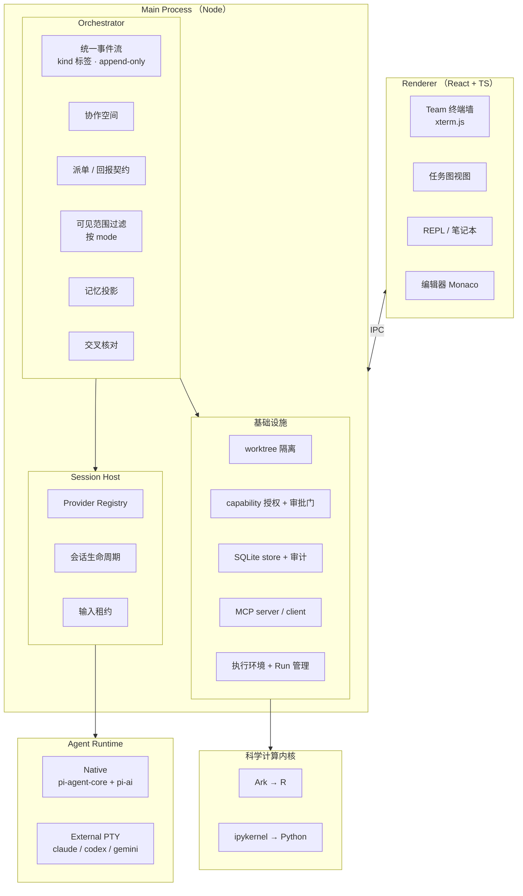
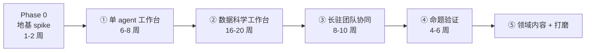

# 多智能体数据科学工作台 — 设计文档

- **日期**：2026-08-06
- **状态**：设计已确认，待 Phase 0 spike 验证地基
- **策略**：**独立实现**。参考项目只读设计，不复用代码。
- **项目名**：**DAWN Science** —— **D**ata **A**gent **W**orkbench with **N**otebooks，for science

---

## 1. 目标

构建一个**面向数据科学的多智能体协同工作台**，形态是桌面应用。

三个层面，**按建造顺序**（先交付确定有价值的，再验证假设）：

1. **单 agent 工作台**：不开编排时，它就是一个能驱动 Claude Code / Codex / 任意 API 模型（含 DeepSeek）的工作台。
2. **数据科学工作台**：持久化的 Python / R 会话，本地与远程（SSH / GPU）执行环境，长任务管理，可复用的 Skill 与 MCP 工具。
3. **长驻团队协同**：一个 leader agent 拆解任务、派发给 coder / researcher / reviewer / tester / critic，每个成员跑在**可见、可接管的真实终端**里。

① + ② 合起来即是一个可日常使用的数据科学工作台；③ 是本项目的实验性命题，见第 2 节。

**形态**：**桌面应用**（不做 Web 版）。信息架构为 `应用 → Project（绑定文件夹）→ Chat`，界面同时提供**对话视图、笔记本视图与并排视图**——三者是同一份事件流的三种投影，见第 8 节。

**设计理念**：`问题 → 规划 → 调用工具 → 执行流程 → 产生可追溯结果`。最后一环由不变式 5（声明层 / 事实层分离）与第 8 节的 append-only Entry 序列共同保证。

**编排的定位**：多智能体编排是一个**可插拔模块**，通过 MCP 与子进程边界与主体解耦。主体不知道编排模块的存在；拔掉它，主体仍是完整的科研工作环境。

**领域定位**：**数据科学 · 生态学 · 环境科学 · 生物信息**。

这四条线的共同点是**数据密集型的自然科学**——观测数据、野外采样、序列数据、环境监测。因此工作台的核心能力（持久 Python/R 会话、远程与 GPU 执行环境、可追溯的分析记录）四者共享，领域差异只体现在可插拔的 Skills 与 MCP 工具层。

---

## 2. 核心命题与它的验证方式

**命题**：多个 agent 交叉验证，能显著降低 AI 幻觉造成的错误交付。

**这是一个假设，不是既定事实。** 已知的反向失败模式包括：

- **附和（sycophancy）**：reviewer 倾向于认同 coder 的工作
- **自我一致性偏差**：agent 维护自己上一轮的判断，不愿推翻
- **幻觉传播**：一个 agent 的错误判断经由自由通信污染其他 agent，最终形成"三个 agent 都这么说"的伪共识
- **测试逢迎**：tester 倾向写能通过的测试，而不是能抓 bug 的测试

**验证方式**（阶段 ④ 交付）：同一批任务，单 agent 基线 vs 多 agent 交叉验证，量化对比缺陷检出率与误报率。本设计的每一条不变式都是为了让这个度量成为可能。

---

## 3. 实现策略：独立实现，不复用代码

### 3.1 三条纪律

参考项目（尤其 wisp-science 与 wispterm）**只读设计，不复用代码**：

1. **概念可以学，表达不能抄** —— 架构思路、契约设计、失败处理策略可自由借鉴；具体代码、独特命名与文件结构不照搬。
2. **从问题出发，不从他们的代码出发** —— 理解其设计动机，按自身理解重新实现。
3. **记录自己的设计决策** —— 既是工程习惯，也是独立创作的证据。

### 3.2 依赖 ≠ 复用

使用一个 MIT 库作为依赖（`import`），与 fork 一个项目性质完全不同。前者等同于使用 React 或 node-pty，不涉及归属问题。

**pi 明确为被 import 而设计**（`createAgentSession()`、`Agent`、`agentLoop()` 均已导出），因此作为常规依赖使用。

### 3.3 由此获得的自由

不接触外部 AGPL 代码 → **项目许可由自己决定，而非被继承**，代码库完整归属自己。

**2026-08-08 定案：AGPL-3.0-or-later。** 这是主动选择，不是被动继承——独立实现让我们本可以选任何许可，最终选 AGPL 是因为希望改进版本同样对所有人开放，包括以网络服务形式提供的版本。

**两个必须记住的推论：**

1. **作为唯一版权人，仍保留再授权（dual-license）与更换许可的权利。** AGPL 约束的是他人的闭源使用，不约束本项目自身。
2. **一旦接受外部贡献且未签 CLA，上述权利即受限**——更换许可需全体贡献者同意。若要长期保留这一自由，需在接受首个外部 PR 前建立 CLA。

### 3.4 代价

以下能力原本可从 wisp-science 直接获得，现需自建：

| 自建项 | 难度 | 备注 |
|---|---|---|
| 执行环境（本地 / WSL / SSH / GPU 探测与管理） | 🔴 高 | 琐碎且平台差异大 |
| 桌面壳与工作台 UI | 🔴 高 | 工作量大 |
| Run 管理（预检、心跳、有界日志、环境快照） | 🟡 中 | |
| 持久化与审计 | 🟡 中 | 主要是 schema + CRUD |
| capability 授权与审批门 | 🟡 中 | 设计难，实现不难 |
| worktree 隔离 | 🟢 低 | |
| Skills 加载 | 🟢 低 | |
| MCP 客户端 | 🟢 低 | 有官方 SDK |
| LLM provider 层 | 🟢 零 | pi-ai 提供 |
| Agent loop | 🟢 零 | pi-agent-core 提供 |

**估计比 fork 路线多 4–8 个月。** 换得的是完整归属、许可自由，以及一个自己完全理解的代码库。

---

## 4. 非目标

以下能力在参考项目中存在且优秀，但**明确不做**。这份清单和功能清单同等重要。

| 不做 | 出处 | 理由 |
|---|---|---|
| Mailbox kernel（fan-in / quorum / wait-all / dead-letter / retry lineage） | ccb | 为跨机器大规模 agent 通信设计，对单机数个 worker 是过度设计。任务依赖已足够 |
| 移动端网关、多 provider CLI 深度适配 | ccb | 范围失控风险 |
| 生物信息学工具链 | wisp-science | 领域不符；后续可作为可插拔扩展引入 |
| 出版工作区、Evidence Capsule | wisp-science | 与核心命题正交 |
| GPU shader、终端主题系统、SSH 端口转发、内嵌浏览器、图形协议 | wispterm | 与核心命题正交 |
| Marketplace、远程访问中继 | hive | 与核心命题正交 |
| 消息平台网关（Telegram / Slack / 飞书 等） | Hermes | 需求中不存在 |
| 自建 agent loop | — | 使用 pi-agent-core |
| 自建 LLM provider 抽象 | — | 使用 pi-ai |
| 自建终端模拟器 | — | 使用 xterm.js + node-pty |
| Jupyter Server / JupyterLab / notebook 运行时 | — | 只使用 Jupyter **消息协议**，不引入其服务端 |

**范围纪律**：任何新增功能必须先回答"它服务于第 2 节的命题吗"。回答不是"是"的，进非目标清单。

### 4.1 主动否决的常见做法

以下四项在通行的多 Agent 方案中被推荐，但**会破坏本项目的核心命题**，明确否决。

| 否决项 | 通行理由 | 否决理由 |
|---|---|---|
| **多 Agent 投票表决**（作为冲突消解手段） | 民主、简单 | **投票是幻觉放大器**。同源模型会产生同向错误，投票让错误显得更可信（"三个 agent 都这么说"）。冲突由**不变式 5 的 Repo 事实层**裁决，不由票数裁决 |
| **无界 P2P / Swarm 自组织** | 降低中枢压力、高容错、动态扩缩 | 否决的**不是通信本身**（协作模式明确允许），而是三件事同时缺失：**无审计**（消息不进统一事件日志）、**无验证隔离**（验证者也泡在同一个消息流里）、**无边界**（agent 数量与轮次不可控）。原方案自己也承认 Swarm"结果不可控、容易出现冗余任务，不适合严谨产出类任务" |
| **Agent 能力向量 Embedding 自动路由** | 自主选人，无需人工指定 | 本项目仅 4–5 个固定角色，语义匹配只会引入不确定性与调试难度。更关键的是它让**模型决定谁获得权限**，违反 capability 授权原则（应由 host policy 决定）。**用规则路由** |
| **引入 CrewAI / AutoGen / LangGraph** | 生态成熟、开箱即用 | 已决定自建 + `pi`。AutoGen 的"群组聊天"本身不是问题，问题是它**不区分协作与验证**——评审者与被评审者同处一个会话流，违反不变式 1 的验证隔离；且引入 Python 编排框架与 TypeScript 技术栈不符 |
| **用 A2A 做内部 leader↔worker 通信** | 标准协议、生态大（150+ 组织） | A2A 官方定位是 *"external agent collaboration rather than single-application orchestration"*。我们是单机、单应用、进程全在自己掌控下的本地编排，套 HTTPS + JSON-RPC + Agent Card 发现纯属开销。且 Claude Code / Codex 本就不是 A2A server，照样要包一层，**工作量一点不省**。A2A 的正确位置是**对外 surface**，见阶段 ⑤ |

> 外部方案的结论与本文档一致，可作为佐证：*"想要实现真正'自主'，核心不在于让 Agent 自由聊天，而是通过契约、结构化数据、状态机减少大模型的随机不可控性。"*

---

## 5. 核心不变式

这五条是系统的地基，任何设计变更都不得违反。

### 不变式 1：验证隔离（生产可协作，验证必独立）

Agent 的信息流按**它此刻在做什么**分两种制度，而非全局禁止通信。

#### 协作模式 —— 生产性角色

`leader` · `coder` · `researcher` 共享一个**可审计的工作空间**：

- ✅ 可以看到彼此的产出与讨论
- ✅ 可以用自然语言交流、追问、协商
- ⚠️ **但每一条都是带类型标签（`kind`）的事件，进同一个 append-only 日志**
- 🚫 **没有私下通道，没有不留痕的耳语**

#### 验证模式 —— 验证性角色

`reviewer` · `tester` · `critic` 与被验证对象**隔离**：

| 能看到 | 看不到 |
|---|---|
| 产物（diff / 文件 / 测试输出 / 运行记录） | 生产过程的叙述与作者辩解 |
| 验收标准（`acceptance_criteria`） | 其他验证者的结论 |
| Repo 事实层证据（不变式 5） | 协作空间的讨论历史 |

每次 fresh 启动（与不变式 2 一致）。

#### 理由

**真正需要隔离的不是"通信"，是验证的独立性。** 人类制度早就是这样设计的——代码评审看 diff，不看作者在群里为什么这么写的辩解；双盲评审时评审人互不知道对方结论。不是因为人不能交流，而是**验证的价值来自独立性**。

**这条不变式阻断的**：
- reviewer 被 coder 说服（"我知道这看起来怪，但……"）
- 多个 agent 收敛到同一个错误，形成"三个 agent 都这么说"的伪共识
- tester 被暗示"这应该能过"

**这条不变式允许的**（早期设计曾错误禁止）：
- 多个 researcher 分头调研后互看结论、补彼此盲区
- coder 向 leader 追问需求歧义
- 方案讨论与头脑风暴

#### 与不变式 2 的合流

生命周期与通信权限由**同一个维度**决定：

```
在生产  →  长驻  +  可协作
在验证  →  fresh +  隔离
```

实现上是成员配置的一个字段：`mode: 'collaborative' | 'verifying'`，它同时决定 `lifecycle` 与可见范围。

#### 结构化通道仍然存在

`dispatch(task)` 与 `report_result(schema)` 不因协作模式而取消——**它们是派单与交付的正式通道**，承载可核对的契约。协作模式下的自由交流是**补充**，不是替代：正式结论必须经由结构化通道落账，聊天记录不构成交付。

### 不变式 2：角色的模式决定生命周期与可见范围

**模式是唯一维度**，它同时决定生命周期与信息可见范围（与不变式 1 合流）。

| 角色 | 模式 | 生命周期 | 可见范围 | 理由 |
|---|---|---|---|---|
| `leader` | 协作 | **长驻** | 协作空间全部 | 需要全局上下文；记忆是投影，见不变式 4 |
| `coder` | 协作 | **长驻** | 协作空间全部 | 上下文累积是纯收益：记得项目结构、记得踩过的坑 |
| `researcher` | 协作 | **长驻** | 协作空间全部 | 调研需要互相补盲区 |
| `reviewer` | 验证 | **每次 fresh** | 仅产物 + 验收标准 | 避免立场固化与被作者说服 |
| `tester` | 验证 | **每次 fresh** | 仅产物 + 验收标准 | 结论必须只依赖当前代码状态 |
| `critic` | 验证 | **每次 fresh** | 仅完整证据链 | 不受生产过程叙述影响 |

**生产的长驻且可协作，验证的一次性且隔离。** 生产力来自协作与上下文累积，可信度来自验证的冷启动与独立性。

实现为成员配置的一个字段：

```ts
mode: 'collaborative' | 'verifying'
// 'collaborative' → lifecycle: 'persistent'，可见协作空间
// 'verifying'     → lifecycle: 'per-task'，仅可见产物与验收标准
```

**不允许自由组合**（例如"长驻的 reviewer"或"可见讨论历史的 tester"）——那正是要防的失效模式。若某个任务确实需要长驻的审查者，应把它建模为一个协作角色（如 `researcher`），并让真正的 `reviewer` 独立复核其结论。

### 不变式 3：没有不可见的行动

系统里发生的每一件事，都是任务账本上一个有明确 executor 的条目。Leader 亲自动手 = 一个 `executor: leader` 的条目。

账本的角色是**记账**，不是**指挥链**——它不限制谁能做什么，只保证做过的事留下痕迹。

### 不变式 4：长驻 agent 的记忆是投影，不是堆积

Leader 与长驻 worker 每次被唤醒时，上下文由引擎**重新构造**：

```
当前任务图快照（含各节点实时状态）
+ 结构化事件日志（压缩，只保留状态转移与验证结论）
+ 最近 N 轮用户对话
```

不是把原始 transcript 一路 append。

**理由**：防止上下文漂移（跑久了历史里堆满废弃计划与失败尝试），同时控制成本。

### 不变式 5：Agent 声明层与 Repo 事实层分离建模

**Session 不是唯一真相，仓库状态才是。**

系统必须把两类信息分开存储、分开推理：

| 层 | 内容 | 可信度 |
|---|---|---|
| **Agent 声明层** | agent 说自己做了什么、结论是什么 | 待验证 |
| **Repo 事实层** | git diff、测试退出码、lint / build 结果、文件 mtime | 权威 |

**状态推进必须由两者的结合决定**，声明单独不足以推进：

```
agent 说"已完成实现"，但测试未通过        → 不得进入 DONE
agent 说"已 review 完成"，但无 review 工件 → 不得完成交接
agent 说"可合并"，但 diff 与计划不一致     → 回到 REWORKING
```

**理由**：这是本项目全部防幻觉能力的第一性原理。第 11 节的"交叉核对"不是一个附加的检查步骤，而是这条不变式在实现层的必然产物。任何"agent 说了算"的路径都是幻觉的入口。

---

## 6. 参考项目定位与边界

**许可证只在复制代码时生效。读架构、学设计、按自己的理解重写，不受约束。**

| 项目 | 许可 | 使用方式 | 学什么 |
|---|---|---|---|
| **AgentDeck**（自有） | 自有 | 📐 **以借鉴设计为主**（代码可用但不强求复用） | 编排内核的设计：租约、verdict 契约、planner/orchestrator 拆分、预览确认、恢复语义。见第 7 节 |
| **pi** | MIT | ✅ **作为依赖 import** | `pi-ai`（40+ provider）、`pi-agent-core`（agent loop + harness） |
| **pi-crew** | MIT | 📐 抄设计，代码可用但**慎用** | GreenLevel 分级、验证环境净化、manifest 快照、相位门、编排成本实测。⚠️ 其 README 自陈「几乎全由 AI 编写，作者未逐行审阅」，作者本人建议 fork 后自行审读 |
| **pi-subagents** | MIT | 📐 抄形态 | 零配置委派的产品形态（周下载为 pi-crew 的 36 倍） |
| **Buzz**（Block, Inc.） | Apache-2.0 | ✅ **可读可用代码** | 进程组终止、截断保全、上下文恢复阶梯、双协议解耦、**agent 作为一等成员 + 统一事件日志**。见 7.18–7.23 |
| **Rho** | MIT | 📐 只读设计 | Ark + Jupyter 协议路线；双进程隔离；前端与传输解耦的协议分层 |
| **wisp-science** | AGPL-3.0 | 📐 **只读设计，不碰代码** | 委派任务契约、capability 授权模型、降级投递与 reviewer 豁免、审批快照失效、崩溃恢复语义 |
| **wispterm** | MIT | 📐 **只读设计，不碰代码** | 终端输入租约；分屏与标签交互；多 CLI 会话检测与恢复 |
| **ccb** | AGPL-3.0 | 📐 只读设计 | provider 适配契约、completion contract |
| **hive** | BUSL-1.1 | 🎨 只看交互 | team 面板与 worker 终端墙的视觉与交互 |

**项目自身许可**：**AGPL-3.0-or-later**（2026-08-08 定案，见 3.3）。依赖的第三方库（`pi` 系列 MIT、Buzz 参考代码 Apache-2.0）与 AGPL 兼容——宽松许可可被 AGPL 项目吸收，反向不可。

---

## 7. 从既有方案吸收的设计

### 7.0 来源说明

| 来源 | 性质 | 采纳内容 |
|---|---|---|
| **AgentDeck**（`multi-agent-explore`） | 自有实现，90,402 行 Python，5351 项测试通过 | 7.1 – 7.7 |
| **multi-agent-orchestrator** | 自有设计文档（744 行，无代码） | 7.8 – 7.9 |
| **hermes-multi-agent-demo** | 自有原型（1,613 行 Python） | 7.10 – 7.11 |
| **跨任务自主协作方案** | 外部综述 | 7.12 – 7.16，及第 4 节新增的四条否决 |
| **Buzz**（Block, Inc.） | 外部实现，266,010 行 Rust，Apache-2.0 | 7.18 – 7.23 |
| **pi-crew** | pi 生态编排扩展，114,268 行 TS，MIT | 7.24 – 7.29 |
| **pi-subagents** | pi 生态委派扩展，64,161 行 TS，MIT（周下载 66k） | 7.30 |

前三者为作者自有产物，可自由借鉴；但**以吸收设计为主，不强求复用其代码**——本项目是独立实现（见第 3 节）。Buzz 为 Apache-2.0，代码亦可直接使用（保留版权声明）。

### 7.1 租约模型（升级原设计）

原设计只有 `acquire(holder)` / 抢占。AgentDeck 的模型更完整：

| 概念 | 作用 |
|---|---|
| `ControllerLease` | 唯一写权持有者，带 TTL |
| `ObserverRegistration` | 观察者注册——多个视图可同时只读观察同一会话 |
| `TakeoverPreview` | **接管前先预览会发生什么**，而非直接夺权 |
| `LeaseAuditEvent` | 每次 acquire / release / takeover 都留审计 |
| `LeaseTransition` + 指纹 | 状态转移带指纹与授权校验，时间戳不可回退 |

**采纳理由**：写权转移是可追责的行为，必须留痕；观察与控制分离让终端墙的"多人看、一人写"成为一等公民。

### 7.2 Verdict 契约（升级原设计）

采纳 `review-verdict/v1`：

```
per-criterion:  pass | fail | unknown
overall:        pass | fail | unknown
score:          可选
```

在原设计基础上新增两条关键机制：

1. **`verdict_summary` 与验收标准对齐**，并报出两类缺口：
   - `unverified` —— 定义了标准但未给出判定
   - `extra` —— 判定了未定义的标准
   
   这堵住了"reviewer 挑好判的答、避开难判的"这一类逃逸。

2. **宽容摄入 / 严格放行**：无效 verdict **不阻塞** reply 入库（保留证据优先），但 `overall != pass` 时**拒绝自动合并**。宽容与严格作用在不同环节。

### 7.3 Planner / Orchestrator 二段拆分

规划分两个阶段，可用不同 backend 与模型：

```
planner       → 宏观简报 + 验收标准       （用强模型）
orchestrator  → 步骤展开                  （可用便宜模型）
```

`planner_brief` 冻结为快照随计划留存。配置校验**失败即停**——子配置指定了不同 provider 却没给 model 时直接报错，绝不把 A 家的模型名喂给 B 家。

### 7.4 精确、过期、一次性的预览确认

Mission 执行前冻结一个**精确预览**，用户必须确认**那一个**预览：

- **exact** —— 确认的是这一份，不是"大概这个意思"
- **expiring** —— 过期作废，防止拿旧预览执行新计划
- **consume-once** —— 用一次即失效

**采纳理由**：防止"确认了 A、执行了 B"这一类最危险的错位。

### 7.5 无静默回退（no silent fallback）

配置了 ACP worker 路由，就必须用它；不可悄悄退回其它传输。任何降级都必须显式报错。

这是本文档"失败要响亮"原则的具体化，提升为全局约束：**能力不可用时报错，绝不静默降级成一个看起来在跑、实则失能的状态。**

### 7.6 取证记录的有界与诚实

ACP transcript 取证的三条规则：

1. **有界** —— 一轮可能几百条，只保留尾部（查错最有用的部分）
2. **截断必须出声** —— 取了多少、`omitted` 多少，写在响应里
3. **没有记录就非 0 退出并说明** —— 不打印空壳让人误以为查过了

### 7.7 只读端点白名单

GUI 只经由固定的少数只读端点取数，所有载荷流经 contract validator。可写操作走独立的、显式注册的控件表，而非放宽端点白名单。

**采纳理由**：GUI 与内核之间保持一条窄而受控的边界；新增能力靠注册控件，不靠开洞。

### 7.8 四层架构（Evidence / Context / Orchestration / Repo Runtime）

采纳这一分层，因为它把"证据"提升到与编排同级：

| 层 | 回答的问题 | 内容 |
|---|---|---|
| **Evidence** | 谁做了什么，依据是什么 | 会话记录、任务消息、交接记录、review 反馈、工件版本、运行结果 |
| **Context** | 大家基于什么共识和规则工作 | `AGENTS.md` / `CLAUDE.md`、`SKILL.md`、workflow 配置、当前任务上下文包 |
| **Orchestration** | 下一步该谁做什么 | 状态机、角色分配、交接触发、review gate、重试与回退 |
| **Repo Runtime** | 仓库真实状态是否允许流程前进 | git、test、lint、build、文件变更、分支 / worktree |

**Repo Runtime 层是不变式 5 的实现载体**：它产出的事实是状态推进的唯一权威依据。

### 7.9 可见性优先于自动化

> visibility first, orchestration second

先做到可观察、可解释、可追溯，再叠加自动编排。这印证了本文档的阶段排序：**阶段 ①（会话宿主，看得见）必须先于阶段 ③（编排内核，自动跑）**。

配套原则：**evidence-backed coordination，而非 summary-first**。每条关键判断都要能追溯到明确来源（某段会话记录 / 某个工件版本 / 某次 git diff / 某次测试输出 / 某次 lint 或 build 结果），而不是仅靠自由文本总结。

### 7.10 协作拓扑作为一等概念

任务图之上再抽象一层**命名的协作模式**，用户不必每次从零描述：

| 拓扑 | 结构 | 用途 |
|---|---|---|
| `fan_out` | 一个目标 → N 个独立任务 | 并行调研、多方向探索 |
| `pipeline` | 任务串行依赖 | 标准开发流水线 |
| **`cross_validate`** | 两个 agent **独立**做同一件事 → 比对差异 | **冗余验证，直接服务于降幻觉** |
| **`arbitrate`** | 两个 agent 各出方案 → 第三个仲裁 | **方案选型，避免单点判断** |

`cross_validate` 与 `arbitrate` 是本文档初稿缺失的两种防幻觉模式。二者按不变式 1 属于**验证模式**——参与方**不得互相看到对方的过程**，只有产出进入比对 / 仲裁环节，否则退化为互相附和。

### 7.11 决策日志与失败案例库

- **决策日志**：记录每次技术 / 架构决策及其事后结果
- **失败案例库**：按错误类型归档失败案例，可查询、可统计

**采纳理由**：失败案例库让"同一个坑不踩第二次"成为可查询的事实，而且它直接为阶段 ④ 的度量框架供数——失败类型分布本身就是幻觉率的一个观测面。两者均可导出为开发历史条目。

### 7.12 工具统一网关与调用结果缓存

所有 agent 经由统一网关调用工具（检索、代码沙箱、文件、数据库）：

1. **权限统一管理** —— 与 capability 授权模型合流
2. **调用结果全局缓存** —— 相同入参直接复用，多个 agent 不重复付费
3. **调用日志全局留存** —— 直接构成 Evidence 层的一部分

**采纳理由**：`cross_validate` 拓扑天然会产生重复调用；缓存让冗余验证的成本可控。

### 7.13 产物按引用传递，不按值传递

前置任务的产出写入共享产物存储，下游 agent 拉取**引用**而非把大文本 / 文件塞进 prompt。

区分两种生命周期：
- **短期上下文** —— 随单次协作生命周期销毁
- **长期协作记忆** —— 持久化，跨会话可检索

**采纳理由**：数据科学任务的中间产物常是大表格与图像，按值传递会迅速吃掉上下文窗口。

### 7.14 多模态成果标准化（数据科学关键）

跨任务流转涉及文本、表格、图片、代码混合，必须标准化，使下游 agent 可直接解析而无需二次文本理解：

| 产物类型 | 标准 |
|---|---|
| 表格 | CSV / JSON，固定 schema |
| 图表 | 附元数据：数据源、指标含义、生成代码引用 |
| 代码 | 附入参 / 出参说明 |
| 模型产物 | 附训练数据引用、超参、评估指标 |

**这一条对本项目的领域（数据科学）尤其关键**，且与 7.13 的引用传递配套。

### 7.15 子任务契约（SLA）

派单时明确约定：输出格式、误差容忍、最大执行时长、失败重试次数、是否可并行。超时自动标记异常。

**重要修正**：原方案表述为"Agent 签收任务后必须按照契约交付"。本项目**不采纳这种基于承诺的语义**——依据不变式 5，agent 的签收与声明都不构成状态推进的依据。契约在此处是**引擎的判定标准**，不是对 agent 的信任。

### 7.16 运行时环形依赖检测与故障自愈分级

- **环形依赖检测**：任务图运行时校验，发现环直接报错并要求重构，不尝试猜测执行顺序
- **故障自愈分级**：轻微异常本地重试 → 依赖缺失向上游请求补全 → 严重异常更换执行者承接

### 7.17 复盘指标扩展

除本文档已有的缺陷检出率与误报率外，补充三项：

- **任务拆解合理性**（返工率、事后被判定为拆错的比例）
- **角色匹配准确率**（派给该角色的任务是否本该由它做）
- **协作损耗**（通信与等待占总耗时的比例）

---

### 7.18 进程组终止（修正原设计的缺陷）

**原设计只终止直接子进程，会留下孤儿。** 采纳 Buzz `buzz-dev-mcp/src/shell.rs` 的 `KillGroup` 模型：

| 环节 | 做法 |
|---|---|
| 启动 | `process_group(0)` —— 子进程立即成为新进程组组长 |
| 优雅终止 | `SIGTERM` → **200ms 宽限** → `SIGKILL`，**发给整个进程组** |
| 兜底终止 | Drop / 异常路径上立即 `SIGKILL` 整组，同步且安全 |
| 解除兜底 | 已显式回收的子进程 `disarm()`，避免误杀复用的 pid |

**为什么对本项目尤其关键**：数据科学 agent 会起 `python train.py`、`npm test` 这类长任务。只杀 shell 会让它们变成孤儿，持续占用 CPU 与 **GPU**——而 GPU 显存不释放会直接卡死后续所有工作。

### 7.19 边界常量与截断保全

采纳 Buzz 的一组具体上限作为起始值：

```
命令超时上限     600_000 ms   (10 分钟)
单条命令长度     1_000_000 B
单次输出         50 KB
单次输出行数     2_000 行
```

**截断处理比"必须出声"再进一步**：响应中显式带 `stdout_truncated` / `stderr_truncated` 标志，**并把完整内容存为 artifact**。

**理由**：查错最需要的往往正是被截掉的部分。出声让人知道有截断，存 artifact 让人还能查回来。这与 7.13 的产物按引用传递是同一套机制。

### 7.20 上下文恢复阶梯（补上原设计的空白）

不变式 4 规定长驻 agent 的记忆是投影，但**原设计默认投影总能成功**。Buzz `buzz-agent/src/handoff.rs` 定义了压不动时的行为：

```
ContextRecovery:
  Recovered   历史已重置，调用方重试
  Cancelled   恢复过程中被取消
  Exhausted   救不了 —— 如实抛出 provider 错误，不再假装能救
```

`Exhausted` 的两个触发条件：
1. per-run 的恢复次数预算耗尽
2. prompt 预算已低于"摘要还能有用"的地板线

**采纳理由**：这是 7.5「无静默回退」在上下文管理上的落地。一个压缩不动却假装还能继续的 agent，会开始基于残缺上下文编造——正是本项目要防的东西。

交接摘要的内容契约（同样采纳）：**原始任务是什么、已完成什么、做了哪些关键决策、还剩什么、下一步具体做什么**。最后一项必须是单个可执行动作，不是方向性描述。

### 7.21 双协议解耦架构

Buzz 的 `buzz-agent` + `buzz-dev-mcp` 是本项目 Native Runtime 的完整参考实现：

```
任意 ACP 客户端  ──stdio ACP──▶  agent（N 个并发会话，各自独立的 MCP / 历史 / 上下文）
                                      │
                                 stdio MCP（每会话一套）
                                      ▼
                                 工具服务端（shell / 文件编辑 / 搜索）
```

三条可直接采纳的原则：

1. **协议即唯一接口** —— agent 不知道对面是哪个 MCP server，MCP server 不知道谁在调用。通过协议组合，不通过 import 组合。
2. **每会话独立的工具服务端实例** —— 完全隔离，与本文档的 per-session 配置隔离一致。
3. **工具调用才是产出** —— 原文：*"The agent's useful output is its tool calls; text is reasoning."* 这直接支撑不变式 5：**要看的是它做了什么，不是它说了什么。**

### 7.22 Agent 作为一等成员（采纳，并据此修正了不变式 1）

Buzz 的核心理念是"agent 是成员，不是机器人"：agent 拥有自己的身份、成员资格，以及与人**同等的行动范围**。

**本文档初稿曾否决这一理念，理由是它与不变式 1 冲突。那个判断是错的**——它把三件独立的事捆在了一起：

| | Buzz 的做法 | 与本项目是否冲突 |
|---|---|---|
| ① **身份与行动范围**：agent 有自己的身份与成员资格，可用动作与人相同 | ✅ | ❌ 不冲突 —— **采纳** |
| ② **可审计性**：每个动作都是带 `kind` 标签的事件，进同一日志 | ✅ | ❌ 不冲突，且与不变式 3 完全一致 —— **采纳** |
| ③ **信息流拓扑**：agent 能否读到彼此的推理并自由回应 | ✅ 无限制 | ⚠️ **仅此项有张力** |

**而 ③ 也不应全面禁止，只应在验证环节禁止。** 这一认识直接导致不变式 1 从"全局禁止自由对话"重写为"**验证隔离**"——生产可协作，验证必独立。

#### 由此采纳的三项

1. **Agent 是一等成员**：拥有独立身份、可参与协作空间、行动范围与人对等——但仍受 capability 授权约束（第 10.3 节），且行动范围由 `mode` 划定（不变式 2）。
2. **统一事件日志**：协作空间的每条消息、每次派单、每份回报、每个 Repo 事实、每次租约转移，都是带 `kind` 标签的事件，进**同一个 append-only 流**。加新能力 = 定义新 `kind`，既有消费者不受影响。

   这也解决了本文档原先的建模冗余——Evidence 层、任务账本、审计日志本是三张表，现合并为一个带类型标签的事件流。**未决问题 5 由此倾向"合并"**，但最终仍在阶段 ③ 落定。

3. **人与 agent 同构**：同一份事件流里，人的发言与 agent 的发言只差一个 `author` 字段。这让"人接管一个 worker"（不变式 1 的租约抢占）在数据模型上无缝——**接管不产生特殊事件类型，只是换了个 author**。

### 7.23 明确不采纳 Buzz 的部分

| 不采纳 | 理由 |
|---|---|
| Nostr 协议、中继、事件签名、每 agent 一个 keypair | 单机单用户。**身份概念采纳，密码学实现不采纳**——本地用普通 ID 即可，签名与中继是纯开销 |
| 多社区租户模型 | 单工作区，不需要 |
| **无差别的自由通信**（验证者也泡在同一消息流里） | 这是 Buzz 与本项目**唯一的实质分歧**。Buzz 面向人机协作，验证独立性不是它的设计目标；本项目的核心命题要求验证隔离，见不变式 1 |

### 7.24 GreenLevel 分级（升级 verdict 契约）

**验证不是二元的。** 采纳 pi-crew `green-contract.ts` 的分级：

```
none  <  targeted  <  package  <  workspace  <  merge_ready
```

任务声明 `requiredGreenLevel`，实测得到 `observedGreenLevel`，`satisfied = observed >= required`。

**为什么比 pass/fail 强**：改一行代码可以让 targeted 测试通过，但 `merge_ready` 要求整个 workspace 绿。原设计的 `pass | fail | unknown` 只回答"过没过"，回答不了"过到什么程度"——而后者才是决定能否合并的依据。

与 7.2 的 `verdict_summary` 组合：per-criterion 判定回答"哪几条满足"，GreenLevel 回答"验证覆盖到什么范围"。

### 7.25 验证命令的环境净化（补上一个安全洞）

**原设计完全没有考虑这个攻击面。** pi-crew `verification-gates.ts` 的原话：

> *"sanitize the env passed to verification commands so worker-induced output cannot leak model-provider secrets… this kills the leak at the source by **never giving the verification process the secret in the first place**."*

**攻击路径**：worker 可以让验证命令（测试 / lint / build）把环境变量打印到输出里，然后从验证输出中读走 API 密钥。

**解法**：验证命令的环境走**白名单**，默认剥离一切；需要密钥的场景必须显式 opt-in 并记入审计。

这条与规格 10.5 的"凭证只进系统密钥环"是互补的两道防线——那条防**存储**泄露，这条防**执行时**泄露。

### 7.26 manifest 快照与它挡不住的东西

pi-crew `verification-integrity.ts` 在验证前后对固定清单（`package.json` / `package-lock.json` / `pyproject.toml` / `Cargo.toml` / `go.mod` / `tsconfig.json` 等）做哈希，检测 worker 在验证期间篡改依赖。

**但真正值得学的是它诚实记录的残余风险**：

| 挡不住 | 原因 |
|---|---|
| **往返篡改** | worker 改 manifest → 跑测试 → 改回去，哈希一致 |
| **被调用脚本篡改** | 只哈希 manifest，不哈希验证命令实际调用的脚本 |
| 传递依赖 | `node_modules/` 不哈希（体积与churn），靠 lockfile 间接钉住 |

其结论直接强化了我们的设计依据：

> *"Content-addressed execution (git-worktree) is required to close this. **Not fixable by hashing.**"*

**即：worktree 隔离（实体 #50）不是可选优化，而是关闭这类篡改的唯一手段。** 哈希只是廉价的第一道网。

### 7.27 顺序相位门

采纳 `verification-gates.ts` 的 RED/GREEN 相位模型：**Phase N 不通过，不得进入 Phase N+1**。

典型序列（npm/TypeScript 项目）：类型检查 → lint → 单元测试 → 集成测试。前一相位失败时，后续相位的"通过"没有意义，直接不跑。

### 7.28 编排成本的实测披露

pi-crew v0.9.15 的 `topology-analyzer.ts` 在每次运行前分类工作流形状（`single` / `sequential` / `concurrent` / `complex-dag`），并打印**带实测证据的建议**：

> *"3-step sequential: measured **5.7× slower** than 3 raw Agent calls — proceeding anyway"*

**关键在最后三个字：never blocks——只告知，不阻拦。**

**为什么必须采纳**：编排不是免费的。串行三步走编排比直接三次调用慢 5.7 倍这个数字，如果不量出来告诉用户，整个多智能体方案就是在拿用户的时间和钱做无声的赌注。

这条与阶段 ④ 的命题验证直接相扣——**"多 agent 是否更准"必须和"多 agent 贵多少"一起报告**，否则度量是片面的。

> **附带教训**：pi-crew 最初实现的是 `level: "block"`（硬拒绝单任务运行），用户反馈后改为 advisory-only，理由是"编排器不知道 agent 的完整上下文"。我们的 G5 决策门（谎报必须被标记）可能遇到同样阻力——**建议区分：事实性判定（谎报检测）硬阻断，启发式判定（成本、拓扑）只建议。**

### 7.29 `needs_attention` 终态

采纳 pi-crew 的一个简洁设计：**没有调用回报工具就结束的任务，状态是 `needs_attention`（终态），而不是 `completed`。**

它允许重试或重跑，且**不阻塞下游相位**。这与我们双保险矩阵里"有 hook 无 report"那一行是同一问题的更简洁表达——值得作为状态机的显式状态而非临时标记。

### 7.30 pi 生态的形态启示

| | pi-subagents | pi-crew |
|---|---|---|
| 周下载 | **66,440** | 1,848 |
| 规模 | 64,161 行 | 114,268 行 |
| 用法 | `pi install` 后直接说"Use reviewer to review this diff" | 建 agent、配 team、写 workflow |

**下载量差 36 倍。** pi-subagents 的 README 第一句是 *"That is the only required step."*——不用建 agent、不用写配置、不用学命令。

**产品形态启示**：市场要的是"随口一说就能用"，不是"先配置一个团队"。本项目的编排入口应默认零配置（leader 自行决定是否派活、派给谁），完整的成员注册表与工作流编辑器是进阶功能，不是必经之路。

### 7.31 worktree 管理的六个实战细节

来自 pi-crew `worktree/`（`worktree-manager.ts` 1,268 行 + `cleanup.ts` + `branch-freshness.ts`）。这些是**跑出来的经验，不是设计出来的**，全部采纳。

#### ① 主仓必须干净，但只看已跟踪文件

```
git status --porcelain --untracked-files=no
```

worktree 契约是"**没有已跟踪文件的改动**"。未跟踪文件是安全的——它们要么在 `.gitignore` 里，要么用户稍后自己处理。

> pi-crew 踩过这个坑：它自己自动创建的 `.gitignore` 曾把 worktree 模式整个卡死。

#### ② 清理前必须先保命（`snapshotDirtyWorktree`）

worktree 要销毁但里面还有改动时，**先完整快照成 artifact 再删**：

- `git diff HEAD --binary` —— 用 `--binary` 才能让二进制改动可被 `git apply` 恢复
- 未跟踪文件逐个保存，**每文件 256 KB 上限**
- **用 `TextDecoder(fatal)` 探测是否 UTF-8**，二进制文件转 base64——否则会被破坏

**原设计只写了"清理 worktree"。** 如果 agent 干了好活但任务判定失败，我们会把它的成果直接扔掉。这条必须补。

#### ③ seedPaths：把未跟踪但必需的文件带进去

`.env`、本地配置、密钥文件不在 git 里，但 worker 需要它们。`seedPaths` 从主仓复制指定路径到 worktree，并且：

- 拒绝逃出 `repoRoot` 的相对路径
- **拒绝符号链接**（防路径穿越逃逸），且在 normalize 与 copy 两处都查——纵深防御

#### ④ `node_modules` 用链接而非复制

`linkNodeModules` 把主仓的 `node_modules` 符号链接进 worktree。对 Node 项目这是数量级的时间差。（Windows 非管理员可能失败，需记录原因而非静默跳过。）

对本项目的等价物：Python 的 venv、R 的 library 路径——**同样应当链接而非重建**。

#### ⑤ 分支新鲜度检查

```ts
type BranchFreshnessStatus = 'fresh' | 'stale' | 'diverged' | 'unknown'
type StaleBranchPolicy = 'warn' | 'block' | 'auto_rebase' | 'auto_merge_forward'
```

**并列出 `missingFixes`**——用 `git log --format=%s branch..main` 把缺失的 commit 标题列出来，而不是只说"落后 3 个提交"。

**为什么重要**：worker 在过时分支上工作，可能重复修一个已经被修好的 bug，或者基于已被推翻的代码做判断。这是一类我们没考虑过的失效。

#### ⑥ git 操作本身也要净化环境

```
// 防止 API key/token 泄露给任何 git hook / alias / credential-helper
```

**这是 7.25 的延伸，攻击面更隐蔽**：仓库里的 `.git/hooks` 或 git alias 会在普通 git 命令执行时被触发，从而读到环境变量。所以**连只读的 `git rev-list` 都要走白名单环境**。

pi-crew 还特意注明：白名单里移除了 `PI_*` 通配，因为它可能匹配到 `PI_PASSWORD` 这类变量。

### 7.32 事件日志：采纳其元数据模型，拒绝其存储选择

#### 采纳：事件元数据的字段设计

pi-crew 的 `TeamEventMetadata` 比原设计丰富得多，逐项采纳：

| 字段 | 作用 |
|---|---|
| **`provenance`** | `live_worker \| test \| healthcheck \| replay \| api \| background \| team_runner` —— **区分真实 worker 事件与测试/重放事件**。同一个日志里混着这些而无法区分，是调试灾难 |
| `causationId` / `correlationId` | 事件溯源标准模式：谁导致了我 / 我属于哪条链 |
| `parentEventId` / `attemptId` / `branchId` | 重试与分支的谱系 |
| `ownership.watcherAction` | `act \| observe \| ignore` —— 这条事件要不要触发反应 |
| **`confidence`** | `low \| medium \| high` —— **事件自身带置信度**。对"交叉核对结果"这类推断性事件尤其有用 |
| `fingerprint` | 去重与幂等 |

另外：**写入前调用 `redactSecrets` 脱敏**——事件流会被投影进 agent 上下文，密钥绝不能经这条路径流出。

#### 拒绝：JSONL 文件存储

pi-crew 用 JSONL + 跨进程文件锁。为此他们付出的代价：

| 他们要自己解决的问题 | 代码量 |
|---|---|
| 跨进程追加锁（含 PID 陈旧锁探测） | event-log.ts 的一部分 |
| 日志轮转与压缩 | `event-log-rotation.ts` 20 KB |
| 流式逐行读 + 环形缓冲（避免把 4 MB 日志读进内存） | 同上 |
| 增量读（`readJsonlSince` / `readJsonlTail`） | `incremental-reader.ts` |
| 序列号缓存 + append 计数器（FIFO 有界） | event-log.ts |
| **worker 线程做同步写** | `worker-atomic-writer.ts` 7.6 KB |

最后一项值得展开——他们的注释记录了一个很深的坑：

> *"multi-step goal-wrapped workflows crash silently and non-deterministically during batch transitions. The crash point moves to every `await` yield in the write path… Hypothesis: **V8/libuv-level race during event-loop yields**. Mitigation: route writes through a dedicated worker thread that performs SYNC fs operations with no internal yields."*

他们还有一个 P0 bug 的记录：全局 append 计数器导致 `0 % 100 === 0` 恒真，于是**每次异步追加都触发一次轮转检查**——日志过 4 MB 后就是全量读+解析+重写。

**本项目用 SQLite（WAL 模式），上述六项全部不存在**：
- 多进程并发写入是 SQLite 的基本能力，有真事务，不需要文件锁
- 不需要手写轮转——`DELETE FROM events WHERE ...` 加索引即可
- 不需要增量读器——`WHERE seq > ?` 加索引
- 不需要 worker 线程——`better-sqlite3` 本就是同步 API，没有 event-loop yield
- 查询能力不在一个量级：按 `kind` / `author` / 时间范围过滤是索引扫描，不是全表 JSON 解析

**公平地说他们为什么选 JSONL**：pi 扩展环境不便携带需要编译的原生依赖（`better-sqlite3` 要编译），且 JSONL 人类可读、可 `grep`、可直接导出。**这个权衡对扩展成立，对我们不成立**——我们是自己的 Electron 应用，运行时完全可控。

> **这是本项目相对 pi-crew 的一个明确技术优势**，且不是靠更聪明，是靠没有它的约束。

---

## 8. 主体核心抽象：对话—笔记本统一模型

> 本文档此前 1,300 行主要在设计**编排层**，主体只有功能清单而无模型。本节补上这个空缺——它是「科研 Agent 工作环境」的核心抽象。

### 8.1 三种形态不是三个产品

科研工作台的界面形态有三种常见选择：

| | 形态 | 代表 |
|---|---|---|
| **A · 纯对话** | 只有消息流，代码执行结果内联 | Claude app |
| **B · 对话 + 独立笔记本** | 左聊天，右可编辑 notebook | wisp-science |
| **C · 对话即笔记本** | 消息流本身就是可重跑的 cell 序列 | 少见，但对科研自然 |

**本项目三者全要——因为它们是同一份数据的三种视图，不是三套实现。**

### 8.2 统一模型：Entry 序列

唯一真相是一个 append-only 的有序 Entry 序列，即不变式 3 的统一事件流在主体层的具体化：

```ts
interface Entry {
  id: EntryId
  seq: number
  kind: 'user_message' | 'assistant_message' | 'code_cell'
      | 'output' | 'tool_call' | 'artifact'
  author: MemberId | 'human'        // 人与 agent 同构（7.22）
  at: string
  content: unknown                  // 由 kind 决定
  meta: EntryMeta
}
```

**当初设计统一事件流是为了满足不变式 3（没有不可见的行动）。现在发现它顺带解决了 A/B/C 的整合——因为笔记本本来就是事件流的一种渲染方式。**

### 8.3 三种视图 = 同一序列的三种投影

| 视图 | 渲染规则 |
|---|---|
| **A · 对话** | 按 `seq` 渲染全部 Entry；`code_cell` 与其 `output` 内联折叠显示 |
| **C · 笔记本** | 只渲染 `code_cell` + `output`，隐藏对话；可重跑、可编辑 |
| **B · 并排** | 左 A 右 C，共享同一序列，双向高亮联动 |

视图切换不涉及数据迁移，只是过滤规则不同。

### 8.4 `code_cell` 是一等公民

**不是「agent 在消息里贴了段代码」，而是创建了一个 cell 实体。**

| 属性 | 含义 |
|---|---|
| 稳定 ID | 可被引用、可被追溯 |
| 可重跑 | 产生新 `output`，旧的保留为历史 |
| 可编辑 | 人接管，改完再跑 |
| 可导出 | 从笔记本视图导出 `.ipynb` / `.py` / `.R` |
| `author` | **人写的 cell 与 agent 写的 cell 同构，只差这一个字段** |

### 8.5 内核状态版本：解决乱序执行

Notebook 的经典问题——cell 乱序执行导致状态不一致。**agent 与人都能跑 cell 时更严重**：你在 cell 3 改了变量，agent 正基于旧值推理。

**解法**：内核维护单调递增的 `kernelRevision`，每执行一次 cell +1。每个 `output` 记录产生时的 revision：

```ts
interface OutputContent {
  cellId: EntryId
  kernelRevision: number      // 产生时的内核状态版本
  streams: OutputStream[]
  displayData?: DisplayData[]
  error?: ExecutionError
}
```

- UI 上，`kernelRevision` 落后于当前值的 output 标记为**陈旧**
- **投喂给 agent 的变量快照必须带 revision**——否则它会基于过期状态推理，这直接违反不变式 5

此设计与 Rho 的 `state revision` 标签同源。

### 8.6 编辑与重跑的 append-only 语义

事件流永不删除、永不原地修改。两种操作都表达为新 Entry：

```ts
{ kind: 'code_cell', rerunOf: 'cell-3',    author: 'human', ... }   // 重跑
{ kind: 'code_cell', supersedes: 'cell-3', author: 'human', ... }   // 编辑
```

**在笔记本视图里的重跑与编辑，同样会出现在对话视图中**（渲染为「你重跑了 cell 3」）。

**理由**：不变式 3 要求所有行动可见。若笔记本操作不进事件流，追溯链就断了——而「产生可追溯结果」是本项目的设计理念第一条。

由此，「这个结论是哪一版代码、在哪个内核状态下产生的」可被精确回答。

### 8.7 UI 骨架

```
┌─────────┬──────────────────────────┬──────────────┐
│ 侧栏     │  主区（A / B / C 视图切换）│  右栏         │
│         │                          │              │
│ Project │  ┌─────────┬──────────┐  │ 内核状态      │
│  ├ Chat │  │ 对话     │ 笔记本    │  │ 变量面板      │
│  ├ Chat │  │ (A)     │ (C)      │  │ 输出 / 图表   │
│  └ Chat │  │         │          │  │ 执行环境      │
│         │  └─────────┴──────────┘  │ 数据库        │
│ Project │        ↑ B = 并排         │ Skills       │
└─────────┴──────────────────────────┴──────────────┘
  状态条：内核 ● 运行中 · 环境 local · 模型 deepseek-chat · [中断]
```

**划分依据**：右栏是 **Project 级**，主区是 **Chat 级**。

### 8.8 关键结构差异：内核的生命周期长于会话

```
Project
 ├── Chat ①  ──┐
 ├── Chat ②  ──┼──→  Kernel（Python / R 持久会话）
 ├── Chat ③  ──┘         ↑ 生命周期比 Chat 长
 ├── Environment（本地 / SSH / GPU）
 ├── Database 连接
 ├── Skills / 任务模板
 └── Artifacts
```

**这是科研工作台与纯聊天应用的根本区别。** 关掉一个 chat，Python 里的 `df` 仍在；明天开新 chat 继续用。

渗透到 UI 的四个后果：

1. 内核状态必须在 **Project 级**可见，不能藏在某个 chat 里
2. 需要跨 chat 的变量面板
3. 「重启内核」影响该 Project 下**所有** chat，必须显式警示
4. Artifact 归属 Project，不归属 Chat

### 8.9 信息架构

```
应用
 └── Project（绑定 workspace 文件夹 + 配置 + 知识 + 内核）
      └── Chat（一次对话 = 一个 Entry 序列）
           └── Entry（message / code_cell / output / tool_call / artifact）
```

「打开文件夹作为新项目」= 创建 Project 并绑定 workspace 路径。这与 Claude app / Codex app / Hermes 的信息架构一致，本项目在 Project 层额外挂载内核、环境、数据库与 Skills。

---

## 9. 架构总览



### 三种 Agent Runtime

| | **Native** | **External PTY** | **ACP**（阶段 ③ 后期） |
|---|---|---|---|
| 实现 | `pi-agent-core` + `pi-ai` | `node-pty` 托管真实 CLI | ACP client（JSON-RPC over stdio） |
| 能力上限 | 注入多少工具就有多少 | Claude Code / Codex 的全部能力 | 对端 agent 的全部能力 |
| 控制力 | 完全：强制 schema、算 token、插工具 | 弱：靠 prompt 与 MCP 影响 | 中：权限请求由我方中介 |
| **完成信号** | 直接可知 | Stop hook / `notify` | **`session/update` 事件流** |
| 进度粒度 | 逐工具 | 靠 hook | **逐工具，协议原生** |
| 可接管 | ❌ 无真终端 | ✅ 真 PTY | ❌ 非终端 |
| 换模型 | ✅ 40+ provider | ❌ 多数锁死 | 取决于对端 |
| 成本 | 低 | 高 | 中 |

三种都可担任 leader 或 worker。DeepSeek 等纯 API 模型经 Native runtime 获得完整工具能力。

**ACP runtime 的不可替代性**：Claude Code 与 Codex 有确定的回合结束信号（Stop hook / `agent-turn-complete`），但 Gemini CLI、opencode、crush 等**缺乏可靠的完成信号，只能靠超时兜底**。对原生说 ACP 的 agent，`session/update` 直接提供确定的回合状态与逐工具进度，并把权限请求转交我方裁决——这补上了双保险在 Tier-2 provider 上的缺口。

**优先级**：阶段 ③ 先做 Native + PTY（覆盖 leader 与可接管 worker 两个硬需求），ACP runtime 在 Tier-2 provider 确实需要时再加。

---

## 10. 功能清单 × 技术栈

### 10.1 技术栈总览

| 层 | 选型 | 理由 |
|---|---|---|
| 核心语言 | **TypeScript / Node**（2026-08-07 定案） | 单人项目单语言是最大杠杆；同类桌面 app 载荷全是 JS/TS；`tsc` 的类型检查是 AI 协同开发最有效的自动纠错；pi 可直接 import。**曾考虑 Python（`jupyter_client`），但 nteract 的 TS 栈已提供等价能力，该优势不复存在** |
| LLM provider | **`@earendil-works/pi-ai`** | MIT，40+ provider，含 DeepSeek 原生 |
| Agent loop | **`@earendil-works/pi-agent-core`** | MIT，含 harness / compaction / skills / tools |
| PTY | **`node-pty`** | 久经考验 |
| 终端渲染 | **`xterm.js`** | 事实标准 |
| MCP | **`@modelcontextprotocol/sdk`** | 官方 SDK，server 与 client 双向 |
| 科学内核 | **`enchannel-zmq-backend` + `@nteract/messaging` + `spawnteract` + `zeromq`** | nteract 栈已实现 HMAC-SHA256 签名、消息分帧、iopub/shell/stdin/control 四通道；一套协议驱动 R（Ark）与 Python（ipykernel）。**须在 Phase 0 Spike D 验证**（下载量偏低 + Electron ABI 重编译） |
| 持久化 | **SQLite（`better-sqlite3`）** | 同步 API，事务清晰 |
| git 操作 | **`simple-git`** | worktree 与 diff |
| 桌面壳 | **Electron** | 主进程即 Node，核心零跨进程开销 |
| 前端 | **React + TypeScript + Vite** | 主流生态 |
| 编辑器 | **Monaco** | 代码编辑与 diff 视图 |
| **笔记本 cell 编辑** | **CodeMirror 6** | 比 Monaco 轻，多实例场景（一屏几十个 cell）性能更好 |
| **图表渲染** | **Plotly.js** + 原生 ``（内核产出的 PNG/SVG） | 覆盖 matplotlib / ggplot2 的静态图与交互图 |
| **表格渲染** | **TanStack Table** | 大数据量虚拟滚动 |
| **`.ipynb` 读写** | **`nbformat` schema**（自实现序列化） | 笔记本视图的导入导出 |
| **Markdown / LaTeX** | `react-markdown` + KaTeX | 科研文本必需 |
| **PDF 渲染** | **`pdf.js`** | 文献阅读模块（见 10.6） |
| 凭证 | **系统密钥环**（`keytar` 或 Electron `safeStorage`） | 绝不落 SQLite |

### 10.2 Session Host（阶段 ①）

| 功能 | 说明 | 技术栈 |
|---|---|---|
| Provider Registry | 两段式 YAML：`endpoints`（地址+凭证）与 `agents`（loop 宿主 + 端点） | YAML + zod 校验 |
| 会话生命周期 | 创建 / 恢复 / 崩溃重启；**状态先落库再改内存** | SQLite |
| Native Runtime | 封装 `createAgentSession()`，注入工具与强制 schema | pi-agent-core |
| External PTY Runtime | 托管 CLI agent，生成 per-session 隔离配置目录 | node-pty |
| ACP Runtime（阶段 ③ 后期） | 驱动原生 ACP agent；补上无可靠 hook 的 provider 的完成信号 | `@zed-industries/agent-client-protocol`（JSON-RPC / stdio） |
| 输入租约 | 同一时刻只有一方能写入 PTY；**用户永远可抢占引擎** | 自建 |
| 终端流转发 | ring buffer + IPC 广播；多视图可同时观察一个会话 | xterm.js |
| 流控 | agent 刷屏时不冲垮前端 | 背压 + 节流 |

### 10.2b 默认 Agent 与切换

**主力 agent 默认走 Native runtime（DeepSeek + agent loop），可随时切到本地安装的 CLI。**

| 选项 | Runtime | 说明 |
|---|---|---|
| **`deepseek-chat`（默认）** | Native（`pi-agent-core` + `pi-ai`） | 成本低、上下文省（据 Databricks 基准，pi 每轮上下文约为 Claude Code / Codex 的 1/3）；工具与 schema 完全可控 |
| `kimi` / `qwen` / `zai` / `minimax` | Native | `pi-ai` 均有原生 provider，切换只改配置 |
| **`claude-code`** | External PTY | 本地已安装的 `claude`；能力最强、可接管键盘 |
| **`codex`** | External PTY | 本地已安装的 `codex` |

切换粒度两级（学 Hermes）：**全局默认** + **会话级覆盖**。UI 上是状态条里的模型下拉；命令面板里也可用 `/model` 切换。

**能力分栏**：选择器按 `kind` 分两栏——「Agent（能干活）」与「Model（只对话）」，避免用户选了纯 API 端点后发现它不会改文件（见第 9 节「三种 Agent Runtime」对照表）。

### 10.2c Skills 与任务模板

**机制直接学 Claude Code / Codex 的插件市场模型**：

```
Marketplace（一个 git 仓库，列出可装的 plugin）
  └── Plugin（版本化）
       └── skills/<name>/SKILL.md      ← YAML frontmatter: name + description
       └── （可选）agents / commands / mcp-servers
```

| 环节 | 做法 | 来源 |
|---|---|---|
| 市场注册表 | `known_marketplaces.json`，用户可添加任意 git 仓库 | 📐 Claude Code |
| 已装清单 | `installed_plugins.json`，含版本 | 📐 Claude Code |
| 本地缓存 | `plugins/cache/<marketplace>/<plugin>/<version>/` | 📐 Claude Code |
| **渐进式加载** | `description` 常驻上下文，正文按需加载——目录不塞满提示词 | 📐 wisp-science `wisp-skills` |
| 触发 | `/` 选择器；或由 `description` 让模型自行判断何时调用 | 📐 Claude Code |

**科研任务模板 = 结构化的 Skill。** 普通 Skill 是「做某类事的指导」；任务模板额外声明**流程骨架**（步骤、每步的验收标准、需要的执行环境与数据），使「问题 → 规划 → 调用工具 → 执行流程」这条主线可被模板化复用。

实现上是 `SKILL.md` frontmatter 的一个可选字段：

```yaml
---
name: differential-expression
description: 当用户需要做差异表达分析时使用……
workflow:                      # ← 有此字段即为任务模板
  - step: 数据质量检查
    acceptance: [样本数 ≥ 3, 缺失率 < 5%]
  - step: 归一化
  - step: 差异检验
  - step: 出图与导出
---
```

**这样任务模板不引入新概念**——它就是带 `workflow` 字段的 Skill，共用同一套市场、缓存与加载机制。

#### 用户自建 Skill

**用户必须能写自己的 Skill，且不必发布到市场。** 三级加载优先级（学 Claude Code）：

```
项目级   <workspace>/.<app>/skills/<name>/SKILL.md    ← 随项目走，可进 git
用户级   ~/.<app>/skills/<name>/SKILL.md              ← 跨项目复用
市场级   plugins/cache/<marketplace>/<plugin>/skills/ ← 安装而来
```

同名时**项目级覆盖用户级覆盖市场级**。应用内提供「新建 Skill」入口，生成 frontmatter 骨架并打开编辑器。

**这是本项目面向科研用户的关键能力**——每个实验室的分析流程都不同，`SKILL.md` 是他们把自己的方法论固化下来、并让 agent 照着做的载体。

### 10.3 Orchestrator（阶段 ③）

| 功能 | 说明 | 技术栈 |
|---|---|---|
| 成员注册表 | 角色 · **`mode`（协作/验证，同时决定生命周期与可见范围）** · runtime · worktree 策略 | SQLite |
| **协作空间** | 协作模式成员共享的可审计工作区；每条消息都是带 `kind` 的事件（不变式 1） | SQLite 事件流 |
| **可见范围过滤器** | 按 `mode` 裁剪投喂给 agent 的上下文；验证角色只见产物 + 验收标准 | 自建 |
| 统一事件日志 | 消息、派单、回报、Repo 事实、租约转移全部同流，`kind` 标签区分（见 7.22） | SQLite append-only |
| 任务账本 | 事件流上的物化视图（或独立表，见未决问题 5） | SQLite |
| 派单通道 | `dispatch(task)`：渲染任务并写入目标会话 | 自建 |
| 回报通道 | 注入 MCP server 暴露 `report_result(schema)` | @modelcontextprotocol/sdk |
| 完成信号 | Claude Code Stop hook / Codex `agent-turn-complete`（`notify`） | per-session hook 配置生成 |
| **交叉核对** | 比对 `report_result` 与 `git diff` / hook 记录的实际命令 | simple-git |
| 角色生命周期策略 | 不变式 2 | 自建 |
| 记忆投影 | 不变式 4；压缩可选用小模型 | pi-ai |
| worktree 隔离 | 每个 coder 一个独立 worktree + 分支 | simple-git |
| capability 授权 | **模型不能给子 agent 授权原始工具**，由 host policy 解析 | 自建 |
| 审批门 | 写 / 执行 / 网络 / 外部服务需显式批准；授权快照失效机制 | 自建 |
| **Planner / Orchestrator 拆分** | 规划用强模型出简报+验收标准，展开可用便宜模型；`planner_brief` 冻结（见 7.3） | pi-ai 双 provider |
| **预览确认** | exact / expiring / consume-once（见 7.4） | 自建 |
| `verdict_summary` 派生 | `unverified` / `extra` 缺口检测 + auto-merge 闸门（见 7.2） | 自建 |
| **协作拓扑模板** | `fan_out` / `pipeline` / `cross_validate` / `arbitrate`（见 7.10） | 自建 |
| **工具网关 + 结果缓存** | 权限统一、相同入参复用、调用日志入 Evidence 层（见 7.12） | 自建 + SQLite |
| **产物存储（按引用传递）** | 短期上下文 vs 长期记忆分离（见 7.13） | 内容寻址 + SQLite |
| **产物 schema 校验** | 表格 / 图表 / 代码 / 模型产物标准化（见 7.14） | zod |
| 子任务 SLA 与超时 | 输出格式、时长、重试次数；引擎判定而非信任声明（见 7.15） | 自建 |
| 环形依赖检测 | 运行时校验，发现环即报错，不猜执行顺序（见 7.16） | 自建 |
| 决策日志 / 失败案例库 | 跨会话沉淀，供阶段 ④ 度量（见 7.11） | SQLite |

### 10.4 科学计算内核（阶段 ②-A）

| 功能 | 技术栈 |
|---|---|
| Jupyter kernel client（一次实现，通吃多语言） | `zeromq` + Jupyter wire protocol（shell / iopub / stdin / control / heartbeat 五通道） |
| R 持久会话 | `posit-dev/ark`（MIT，固定版本 + sha256 校验） |
| Python 持久会话 | `ipykernel` |
| **中断正在执行的 cell** | 进程组信号（Unix）；Windows 需专门实现 |
| 富输出（图 / HTML / 表） | `display_data` + comm 通道 |

> **不引入 Jupyter Server / JupyterLab / notebook 运行时**，只使用消息协议本身。

### 10.5 执行环境与 Run 管理（阶段 ②-B）

| 功能 | 技术栈 |
|---|---|
| 环境探测（本地 / WSL / SSH / GPU） | Node `ssh2` + 探测脚本 |
| 每环境独立解释器路径 | SQLite |
| Run 管理：提交前预检、心跳、有界日志、环境快照 | SQLite + 流式日志截断 |

### 10.6 数据科学领域内容（阶段 ⑤）

#### 文献阅读与解读模块

科研平台的必备能力，**但实现路径是 Skill 而非硬编码功能**：

| 层 | 内容 | 技术栈 |
|---|---|---|
| **渲染** | PDF 在应用内可读、可选中、可框选区域 | `pdf.js` |
| **抽取** | 文本、图表、表格、参考文献的结构化抽取 | `pdf.js` 文本层 + 可选的版面分析 |
| **投喂** | 抽取结果按需注入 agent 上下文（**按引用传递**，不整篇塞 prompt，见 7.13） | 产物存储 |
| **解读** | **由 Skill 定义**——"文献精读""方法学复核""相关工作梳理"各是一个 Skill | `SKILL.md` |

**为什么解读层放在 Skill 里**：不同学科、不同目的的读法差别极大（读方法 vs 读结论 vs 找可复现细节）。硬编码一种读法必然不合用；做成 Skill 则**用户可以写自己的读法**（见 10.2c 用户自建 Skill）。

应用只负责三件事：**能渲染、能抽取、能按引用投喂**。


| 层 | 内容 |
|---|---|
| `skills/` | ML / DL 工作流：特征工程、模型训练与评估、实验追踪、超参搜索、数据清洗 |
| `mcp-servers/` | 数据集检索、实验追踪、模型仓库、文档查询 |

---

## 11. 关键接口草案

```ts
// ── 团队成员 ────────────────────────────────────────────
type Role = 'leader' | 'coder' | 'researcher' | 'reviewer' | 'tester' | 'critic'

interface TeamMember {
  id: MemberId
  role: Role
  /** 唯一维度：同时决定生命周期与可见范围（不变式 1 + 2 合流） */
  mode: 'collaborative' | 'verifying'
  runtime: { kind: 'native'; agentId: string }
         | { kind: 'pty';    agentId: string }
         | { kind: 'acp';    agentId: string }
  workspacePolicy: 'own-worktree' | 'read-only-snapshot' | 'inherit'
}

// mode 派生出的两个属性，不可单独覆写
const DERIVED = {
  collaborative: { lifecycle: 'persistent', visibility: 'collaboration-space' },
  verifying:     { lifecycle: 'per-task',   visibility: 'artifacts-and-criteria' },
} as const

// ── 统一事件流（不变式 3 + 7.22 + 7.32） ─────────────────
interface Event {
  id: EventId
  seq: number                    // 单调序列，SQLite 主键
  kind: EventKind                // 'message' | 'dispatch' | 'report' | 'repo_fact'
                                 // | 'lease_transition' | 'verdict' | ...
  author: MemberId | 'human'     // 人与 agent 同构，只差这一个字段
  at: string
  payload: unknown               // 由 kind 决定的 schema，写入前经 redactSecrets
  meta: EventMeta
}

// 元数据字段取自 pi-crew TeamEventMetadata（见 7.32）
interface EventMeta {
  provenance: 'live_worker' | 'test' | 'healthcheck' | 'replay' | 'api' | 'background' | 'engine'
  causationId?: EventId          // 谁导致了我
  correlationId?: string         // 我属于哪条链
  parentEventId?: EventId
  attemptId?: string             // 重试谱系
  confidence?: 'low' | 'medium' | 'high'   // 推断性事件（如交叉核对结论）的置信度
  fingerprint?: string           // 去重与幂等
}

/** 可见范围过滤：验证角色拿不到协作空间的讨论 */
function visibleTo(member: TeamMember, events: Event[]): Event[] {
  if (member.mode === 'collaborative') return events
  return events.filter((e) => e.kind === 'repo_fact' || e.kind === 'dispatch')
}

// ── Agent 运行时（两种实现共用同一接口） ────────────────
interface AgentRuntime {
  start(spec: SessionSpec): Promise<SessionHandle>
  attach(id: SessionId): EventStream          // 多视图可同时观察
  write(id: SessionId, data: string, lease: Lease): void
  stop(id: SessionId): Promise<void>
}

// ── 租约（采纳 AgentDeck 模型，见 7.1） ──────────────────
interface ControllerLease {                  // 唯一写权，带 TTL
  sessionId: SessionId
  holder: 'engine' | 'user'
  expiresAt: string
  fingerprint: string
}
interface LeaseManager {
  observe(session: SessionId, clientId: string): ObserverRegistration  // 只读，可多个
  previewTakeover(session: SessionId): TakeoverPreview                 // 夺权前先看后果
  acquire(session: SessionId, holder: Holder): Promise<ControllerLease>
  release(lease: ControllerLease): void
  auditLog(session: SessionId): LeaseAuditEvent[]   // acquire/release/takeover 全留痕
}
// 'user' 可抢占 'engine'；反向不可。时间戳不可回退。

// ── 回报契约（注入给 worker 的 MCP 工具，采纳 review-verdict/v1） ──
report_result({
  task_id: string,
  outcome: 'completed' | 'blocked' | 'failed',
  criteria: Array<{
    id: string,
    verdict: 'pass' | 'fail' | 'unknown',   // 'unknown' 是必须存在的诚实出口
    evidence: string,                        // 必填：文件:行 或 命令输出
  }>,
  overall: 'pass' | 'fail' | 'unknown',
  observedGreenLevel: GreenLevel,            // 见 7.24：验证覆盖到什么范围
  score?: number,
  changed_files: string[],                              // 与 git diff 交叉核对
  commands_run: Array<{ cmd: string, exit_code: number }>,  // 与 hook 记录交叉核对
  summary: string,
  blockers?: string[],
})

// 验证覆盖范围分级（7.24）
type GreenLevel = 'none' | 'targeted' | 'package' | 'workspace' | 'merge_ready'

// 引擎侧派生（不由模型提供）：
interface VerdictSummary {
  unverified: CriterionId[]      // 定义了标准却没判定 —— 堵住"挑好判的答"
  extra: string[]                // 判定了未定义的标准
  greenSatisfied: boolean        // observedGreenLevel >= requiredGreenLevel
  autoMergeAllowed: boolean      // overall === 'pass' && greenSatisfied
}

// 任务状态（7.29）：没调回报工具就结束 → needs_attention，不是 completed
type TaskState = 'pending' | 'running' | 'completed' | 'failed'
               | 'needs_attention' | 'untrusted' | 'blocked'
```

**宽容摄入 / 严格放行**：verdict 无效不阻塞 reply 入库（保留证据优先），但 `overall !== 'pass'` 时拒绝自动合并，需人工显式确认。

### 双保险判定矩阵

| 情况 | 引擎行为 |
|---|---|
| 有 report + 有 hook + 一致 | `succeeded` |
| 有 hook，无 report | 主动读 `git diff` 合成 `outcome: unknown`，升级给 leader |
| 有 report，无 hook（provider 无 hook 能力） | 接受但标 `unverified`，必须走超时兜底 |
| 两者皆无 | 超时 → `failed`，唤醒 leader |
| **report 与 `git diff` 对不上** | **标 `untrusted`** —— agent 在报告中陈述了不实内容 |

最后一行是本架构最有价值的产出：**"声称改了 X 但实际没改" 是可被机器检测的幻觉**，不需要另一个 LLM 判断。

### 验收标准的设计

reviewer 不被问"这代码好不好"（开放式 → 附和），而被问"逐条判定这几条标准是否满足"（封闭式 → 可核对）。`cannot_determine` 必须存在，否则模型被迫二选一然后编造。

---

## 12. 开发蓝图

**排序原则**：先交付确定有价值的，再验证假设。阶段 ① + ② 合起来即是一个可日常使用的数据科学工作台；阶段 ③ 才是本项目的实验性命题。



**总体估计 10–14 个月**（单人 + AI 协同）。每个阶段独立交付价值，随时可停在一个可用状态。

---

### Phase 0 · 地基 spike（1–2 周）— 硬性前置门

三个独立验证，任何一个不通过都要改方案。详见第 13 节。

| 验证 | 问题 | 失败则 |
|---|---|---|
| A · pi 可嵌入性 | `createAgentSession()` 能否注入自定义工具并强制 JSON Schema | 改自建 loop 或全走 PTY |
| B · PTY + MCP + Hook | 能否在隔离配置下注入 MCP 并接到 Stop hook | 回报通道退回注入 shell 命令 |
| C · Electron 终端 | 4 个 `node-pty` + `xterm.js` 同时跑是否流畅 | 重选桌面壳 |

---

### 阶段 ① · 单 agent 工作台（6–8 周）— 第一个可用产品

> 不开编排时，它就是个能驱动 Claude Code / Codex / DeepSeek 的工作台。

**开发内容**

| 模块 | 内容 |
|---|---|
| Provider Registry | 两段式 YAML：`endpoints`（地址+凭证）/ `agents`（loop 宿主+端点）；zod 校验；能力分栏（Agent 能干活 / Model 只对话） |
| Native Runtime | 封装 `createAgentSession()`；工具注入；强制 output schema；token 计量 |
| External PTY Runtime | 托管 claude / codex；**per-session 隔离配置目录**（绝不污染用户全局配置） |
| 会话生命周期 | 创建 / 恢复 / 崩溃重启；**状态先落库再改内存** |
| 输入租约 | `ControllerLease` + 观察者注册 + 夺权预览 + 审计事件 |
| 终端流 | ring buffer + IPC 广播 + 背压节流 |
| 多会话 UI | 标签 / 分屏；xterm.js 渲染；会话切换 |
| 持久化 | SQLite schema + 迁移；scrollback 截断保留 |
| 桌面壳 | Electron 主进程 + 渲染进程；macOS 优先打包 |

**技术栈**：TypeScript · `@earendil-works/pi-ai` · `@earendil-works/pi-agent-core` · `node-pty` · `xterm.js` · `better-sqlite3` · `zod` · Electron · React + Vite

**灵感来源**

| 设计 | 来自 |
|---|---|
| 两段式 provider 配置（endpoints / agents 分离） | **Hermes**（其扁平 provider 列表的改进版） |
| per-session 配置隔离 | **ccb** 的 `*-session-isolation-contract.md` |
| 输入租约完整模型 | **AgentDeck** `daemon/lease.py` + **wispterm** `terminal_lease.zig` |
| 终端流转发与流控 | **hive** `terminal-flow-control.ts` / `pty-output-bus.ts` |
| 状态先落库再改内存 | **hive** `AGENTS.md` 硬规则 |
| agent loop 与 provider 层 | **pi**（直接 import，非借鉴） |

**验收**：同时开 4 个会话（2 个 Native DeepSeek + claude + codex），全部可正常对话；claude / codex 那两个能真接管键盘；应用重启后会话可恢复。**此时编排一行未写，产品已可日常使用。**

---

### 阶段 ② · 数据科学工作台（16–20 周）— 你的主力工具

> 持久 Python/R 会话、本地与远程执行环境、长任务管理、Skills。

分两个可独立交付的里程碑。

#### ②-A 科学计算内核（8–10 周）

| 模块 | 内容 |
|---|---|
| Jupyter kernel client | **一次实现，通吃多语言**；五通道（shell / iopub / stdin / control / heartbeat） |
| R 会话 | 集成 `posit-dev/ark`（固定版本 + sha256 校验） |
| Python 会话 | 集成 `ipykernel` |
| **中断** | 进程组信号（Unix）；打断正在执行的 cell |
| 富输出 | `display_data` + comm 通道；图 / HTML / 表渲染 |
| 变量检查 | `inspect` → 命名空间对象列表（有上限） |
| REPL / 笔记本 UI | 结构化 Console（**不是** xterm.js）；产物面板 |

**技术栈**：`zeromq` · Jupyter wire protocol · Ark · ipykernel · React 渲染层

**灵感来源**

| 设计 | 来自 |
|---|---|
| 用真 Jupyter 协议而非自研 JSON-lines | **Rho**（对比 wisp-science 的自研 worker：无中断、每语言一套） |
| 只用协议不引入 Jupyter Server | **Rho** 明确的边界划分 |
| 中断是 kernel-manager 职责（进程组信号） | **Rho**，且其亦列为前置门 |
| 结构化 Console，xterm.js 只给真 shell | **Rho** 的明确禁令 |
| 变量清单与输出上限 | **wisp-science** `kernel_worker.py`（1MB 截断 / 200 对象） |

**验收**：R 与 Python 会话均可持久、**可中断**、可渲染图与表；两者共用同一套协议实现。

#### ②-B 执行环境与 Run 管理（8–10 周）

| 模块 | 内容 |
|---|---|
| 环境探测 | 本地 / WSL / SSH / GPU；一次连接完成硬件与运行时探测 |
| 环境注册表 | 每环境独立解释器路径；连接失败开闸门而非静默重试 |
| Run 管理 | 提交前预检、每秒心跳、有界日志、随环境快照持久化 |
| 凭证 | 只进系统密钥环，**绝不落 SQLite** |
| Skills | `SKILL.md` 渐进式加载（不塞满提示词） |
| 产物存储 | 内容寻址；**按引用传递**；短期上下文 vs 长期记忆分离 |
| 产物 schema | 表格 CSV/JSON、图表附元数据、代码附出入参、模型产物附超参与指标 |

**技术栈**：`ssh2` · SQLite · `keytar` / Electron `safeStorage` · zod

**灵感来源**

| 设计 | 来自 |
|---|---|
| 执行环境模型（本地/WSL/SSH/GPU + 独立解释器路径） | **wisp-science** |
| Run 管理（预检 / 心跳 / 有界日志 / 环境快照） | **wisp-science** |
| 凭证只进密钥环 | **wisp-science** |
| Skills 渐进式加载 | **wisp-science** `wisp-skills` |
| 产物按引用传递、成果标准化 | 跨任务协作综述（见 7.13 / 7.14） |

**验收**：能在本地与一台远程 SSH 主机上分别跑同一份分析；长任务可提交、可监控、可取消；重启后 Run 状态可恢复。

> **关键设计约束**：本阶段产出的 Run 记录、测试退出码、kernel 执行结果**必须能作为阶段 ③ 的 Repo 事实层证据**（不变式 5）。设计数据模型时即按此要求，避免 ③ 返工。

---

### 阶段 ③ · 长驻团队协同（8–10 周）— 核心命题

> leader 拆任务派给 coder / reviewer / tester / critic，每个成员在可见、可接管的真终端里干活。

| 模块 | 内容 |
|---|---|
| 成员注册表 | 角色 · **生命周期**（不变式 2）· runtime · worktree 策略 |
| 任务账本 | append-only、版本化；环形依赖运行时检测 |
| 派单 / 回报 | `dispatch(task)` / `report_result(schema)`，MCP 注入 |
| 完成信号 | Claude Stop hook / Codex `agent-turn-complete` |
| **交叉核对** | report 对照 `git diff` 与 hook 记录 → 不符标 `untrusted`（不变式 5） |
| `verdict_summary` | `unverified` / `extra` 缺口检测 + auto-merge 闸门 |
| 记忆投影 | 长驻 agent 上下文重建，非堆积（不变式 4） |
| worktree 隔离 | 每 coder 一分支工作区 + 冲突检查合并 |
| capability 授权 | host policy 解析；**模型不能给子 agent 授权原始工具** |
| 审批门 | 写 / 执行 / 网络需显式批准；授权快照失效 |
| Planner / Orchestrator 拆分 | 规划用强模型，展开用便宜模型；简报冻结 |
| 预览确认 | exact / expiring / consume-once |
| 协作拓扑 | `fan_out` / `pipeline` / `cross_validate` / `arbitrate` |
| 工具网关 | 权限统一 + 相同入参结果复用 + 调用日志入 Evidence 层 |
| Team 终端墙 | 多成员终端并排、实时、点击接管 |
| ACP Runtime（后期） | 补 Tier-2 provider 的完成信号 |

**技术栈**：`@modelcontextprotocol/sdk` · `simple-git` · SQLite · `@zed-industries/agent-client-protocol`

**灵感来源**

| 设计 | 来自 |
|---|---|
| 声明层 / 事实层分离（不变式 5） | **multi-agent-orchestrator** plan.md |
| 四层架构（Evidence / Context / Orchestration / Repo Runtime） | 同上 |
| `review-verdict/v1` + 缺口检测 | **AgentDeck** `review_verdict.py` |
| Planner / Orchestrator 拆分、预览确认、无静默回退 | **AgentDeck** |
| capability 授权、worktree + 冲突检查合并、降级投递 | **wisp-science** `delegation_policy.rs` / `delegation_isolation.rs` |
| 协作拓扑（`cross_validate` / `arbitrate`） | **hermes-multi-agent-demo** `orchestrator.py` |
| team 终端墙交互 | **hive**（只看交互，不碰代码） |
| 工具网关 + 结果缓存、SLA、环形依赖检测 | 跨任务协作综述 |
| MCP + Hook 双保险、角色决定生命周期 | 自研 |

**验收**：真实需求跑通 `leader → coder → reviewer → tester → critic`，产出完整可审查账本；**人为让 worker 谎报改动，系统能标出 `untrusted`**。

---

### 阶段 ④ · 命题验证（4–6 周）

| 内容 |
|---|
| 任务图可视化与编辑 |
| **度量框架**：单 agent 基线 vs 多 agent 交叉验证，缺陷检出率与误报率 |
| 附和检测：reviewer 通过率是否异常偏高 |
| 扩展指标（见 7.17）：拆解合理性、角色匹配准确率、协作损耗 |
| 决策日志 / 失败案例库统计 |
| 运行报告与导出 |

**灵感来源**：决策日志与失败案例库来自 **hermes-multi-agent-demo**；复盘指标来自跨任务协作综述。

**验收**：得到第 2 节命题的**量化答案**，不论正负。若为负，产品定位需重新审视——但阶段 ①② 的工作台独立成立，价值不受影响。

---

### 阶段 ⑤ · 领域内容与打磨

- `skills/` 填充 ML / DL 工作流：特征工程、模型训练与评估、实验追踪、超参搜索、数据清洗
- `mcp-servers/`：数据集检索、实验追踪、模型仓库、文档查询
- **对外 surface**（见下）
- 跨平台打包与发布

#### 协议 surface：入与出

协议在本项目中**只用于边界，从不用于内部通信**。内部的正式派单与交付始终是 `dispatch` / `report_result`，协作模式下的自由交流则走内部的协作空间事件流（见不变式 1）。

| 方向 | 协议 | 形态 | 价值 |
|---|---|---|---|
| **入**（我们驱动别人） | ACP client | 第三种 Runtime，见第 9 节 | 驱动原生 ACP agent，补 Tier-2 provider 的完成信号 |
| **出**（别人驱动我们） | ACP agent | leader 暴露为 ACP server | 在 Zed / Neovim / JetBrains 里直接使唤你的 leader |
| **出**（别人委派给我们） | **A2A agent** | 暴露 Agent Card + task 端点 | **把整个多智能体团队变成外部系统可调用的一个 agent** |

A2A 那一行是它对本项目的**唯一正确用法**：不是内部消息总线，而是让别的系统能把任务委派给你的团队，并按 A2A 的 Task 生命周期（Submitted / Working / Completed）追踪结果、按 Artifact 取回产物。

三者都是可选项，取决于你是否真的需要与外部生态互通。

---

## 13. Phase 0 决定性 Spike

三个独立验证，**任何一个不通过都要改方案**。

### Spike A · pi 可嵌入性（2–3 天）

1. `createAgentSession()` 起一个会话，配 DeepSeek 端点
2. 注入一个自定义工具，确认 **JSON Schema 强制生效**（填错会被拒绝并要求重填）
3. 确认可拿到流式事件、token 用量、工具调用记录

**失败则**：改用自建 agent loop，或改走全 External PTY 路线。

### Spike B · PTY + MCP + Hook 三件套（3–4 天）

1. `node-pty` 起一个 `claude` 进程，可交互
2. 生成 **per-session 隔离配置目录**（不污染用户全局 `~/.claude`），注入一个自建 MCP server
3. 确认 agent 能看到并调用该 MCP 工具
4. 配置 Stop hook，确认回合结束时能触发到你的进程
5. Codex 侧同样验证（`config.toml` 的 `notify` + `agent-turn-complete`）

**失败则**：回报通道退回"注入 shell 命令"（hive 路线），可靠性下降。

### Spike C · Electron 终端可用性（2 天）

1. Electron 主进程跑 `node-pty`，渲染进程用 `xterm.js`
2. 确认输入输出双向通畅、resize 正确、大量输出不卡死
3. 同时开 4 个终端，确认性能可接受

**失败则**：重新评估桌面壳选型。

### 并行调研（可选）

- Jupyter wire protocol 在 Node 中的 zeromq 绑定是否稳定（影响阶段 ②-A）
- Ark 的 macOS 二进制能否直接启动

---

## 14. 风险与未决问题

| 风险 | 影响 | 缓解 |
|---|---|---|
| **周期长**（10–14 个月） | 中途失去动力 | 阶段 ① 结束即有可用产品，① + ② 即完整工作台；每阶段独立交付价值 |
| **Provider 适配腐烂** | CLI 配置格式频繁变更 | 每个 provider 一个 smoke test；失败必须**响亮报错**，禁止静默降级 |
| **中断机制**（Jupyter 内核） | 阶段 ②-A 受阻 | Rho 亦将其列为前置门；Unix 侧比 Windows 简单 |
| **核心命题被证伪** | 产品定位失效 | 阶段 ④ 给出答案；工作台部分独立成立 |
| **执行环境自建成本超预期** | 阶段 ②-B 拖长 | 可裁剪：先只做本地 + SSH，GPU 后置 |
| **worktree 合并冲突** | 并行 coder 互相阻塞 | MVP 由 leader 保证任务文件集不重叠；冲突解决后续可派给 agent |
| **pi 的 API 稳定性** | 依赖破坏 | 锁定版本；在 Session Host 内做一层薄封装隔离，不让 pi 类型泄漏到 Orchestrator |

### 未决问题

1. 任务账本是否需要完整 DAG，还是线性事件流 + 依赖引用即可？（阶段 ③ 决定）
2. Leader 走 Native 还是 PTY？（阶段 ① 依据实际体验决定）
3. 记忆投影的压缩用规则还是小模型？（阶段 ③ 决定）
4. 多 worker 的终端墙布局：网格、标签页，还是可拖拽分屏？（阶段 ③ 决定）
5. Evidence 层、任务账本、审计日志合并为**一个带 `kind` 标签的 append-only 事件流**（Buzz 模型，见 7.22）——协作空间的引入使其近乎必然，**当前倾向合并**；剩余待定的是查询侧是否需要物化视图。（阶段 ③ 落定）

---

## 附录：术语

- **ACP**：Agent Client Protocol（Zed），编辑器 ↔ agent 的 UI 协议，JSON-RPC over stdio。**协议 schema 中不含 agent 间委派语义**。与 IBM 的 Agent Communication Protocol 同名但无关。本项目双向使用：作为 client 驱动外部 ACP agent（第三种 Runtime），作为 server 让编辑器驱动我方 leader。
- **A2A**：Agent2Agent Protocol，Linux Foundation 项目（Google 2025-06 捐赠），v1.0.1（2026-05），150+ 组织采用。HTTPS + JSON-RPC，长任务走 SSE。核心概念：Agent Card（`/.well-known/agent-card` 能力发现）、Task（Submitted / Working / Completed）、Message、Artifact。**定位为跨组织互操作，非单应用内部编排**。本项目仅将其作为可选的对外 surface。
- **MCP**：Model Context Protocol，向 agent 暴露工具与资源。本项目用它承载 `report_result` 等受 schema 约束的回报通道。
- **Native runtime**：`pi-agent-core` + 任意模型 API。可控、可注入工具、可强制 schema；无可接管终端。
- **External PTY runtime**：把 claude / codex 等完整 CLI agent 跑在真实终端里。能力最强、可接管；控制力弱。
- **worktree**：git 的多工作区机制，用于隔离并行 agent 的文件修改。
- **输入租约**：同一 PTY 同一时刻只有一方可写；用户可抢占引擎。
